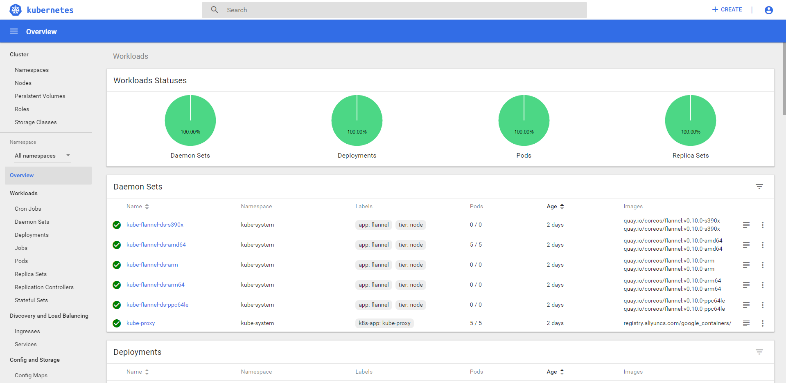
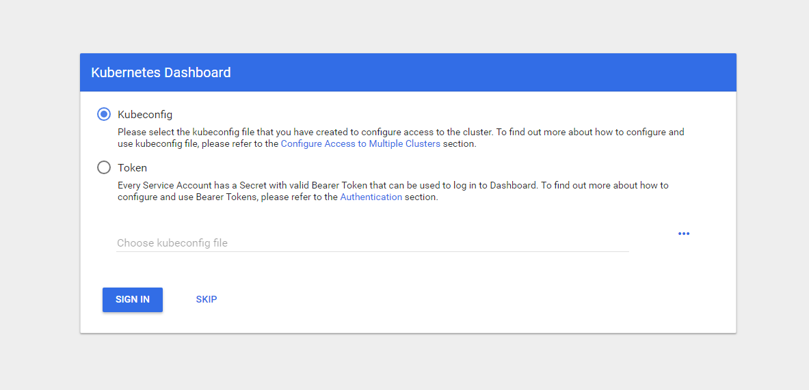

kubeadm 1.13 安装高可用 kubernetes v1.13.1 集群
---



在开始前，先看 kubernetes dashboard 的图，提起来一点信心（虽然 dashboard 组件在 k8s 正常运转中是可以不用的）。


## 目录

* [一、环境准备](#%E4%B8%80%E7%8E%AF%E5%A2%83%E5%87%86%E5%A4%87)
    * [1\. 准备本地虚拟机](#1-%E5%87%86%E5%A4%87%E6%9C%AC%E5%9C%B0%E8%99%9A%E6%8B%9F%E6%9C%BA)
    * [2\. 虚拟机账号和 sudo 免密](#2-%E8%99%9A%E6%8B%9F%E6%9C%BA%E8%B4%A6%E5%8F%B7%E5%92%8C-sudo-%E5%85%8D%E5%AF%86)
    * [3\. 免密登录](#3-%E5%85%8D%E5%AF%86%E7%99%BB%E5%BD%95)
    * [4\. 关闭 SELinux 、关闭 swap 分区和配置 iptables](#4-%E5%85%B3%E9%97%AD-selinux-%E5%85%B3%E9%97%AD-swap-%E5%88%86%E5%8C%BA%E5%92%8C%E9%85%8D%E7%BD%AE-iptables)
* [二、安装架构概览](#%E4%BA%8C%E5%AE%89%E8%A3%85%E6%9E%B6%E6%9E%84%E6%A6%82%E8%A7%88)
* [三、安装步骤](#%E4%B8%89%E5%AE%89%E8%A3%85%E6%AD%A5%E9%AA%A4)
  * [1\. Docker 环境](#1-docker-%E7%8E%AF%E5%A2%83)
  * [2\. 安装 kubernetes yum 源和 kubelet、kubeadm、kubectl](#2-%E5%AE%89%E8%A3%85-kubernetes-yum-%E6%BA%90%E5%92%8C-kubeletkubeadmkubectl)
  * [3\. 初始化 kubeadm 配置文件](#3-%E5%88%9D%E5%A7%8B%E5%8C%96-kubeadm-%E9%85%8D%E7%BD%AE%E6%96%87%E4%BB%B6)
  * [4\. 安装 master 镜像和执行 kubeadm 初始化](#4-%E5%AE%89%E8%A3%85-master-%E9%95%9C%E5%83%8F%E5%92%8C%E6%89%A7%E8%A1%8C-kubeadm-%E5%88%9D%E5%A7%8B%E5%8C%96)
    * [4\.1 拉所需镜像到本地](#41-%E6%8B%89%E6%89%80%E9%9C%80%E9%95%9C%E5%83%8F%E5%88%B0%E6%9C%AC%E5%9C%B0)
    * [4\.2 安装 master m01](#42-%E5%AE%89%E8%A3%85-master-m01)
      * [i\. kube 用户配置](#i-kube-%E7%94%A8%E6%88%B7%E9%85%8D%E7%BD%AE)
      * [ii\. 验证结果](#ii-%E9%AA%8C%E8%AF%81%E7%BB%93%E6%9E%9C)
      * [ii\. 安装 CNI 插件 flannel](#ii-%E5%AE%89%E8%A3%85-cni-%E6%8F%92%E4%BB%B6-flannel)
    * [4\.3 安装剩余 master](#43-%E5%AE%89%E8%A3%85%E5%89%A9%E4%BD%99-master)
      * [4\.3\.1 同步 m01 的 ca 证书](#431-%E5%90%8C%E6%AD%A5-m01-%E7%9A%84-ca-%E8%AF%81%E4%B9%A6)
      * [4\.3\.2 安装 master m02](#432-%E5%AE%89%E8%A3%85-master-m02)
        * [1\. 配置证书、初始化 kubelet 配置和启动 kubelet](#1-%E9%85%8D%E7%BD%AE%E8%AF%81%E4%B9%A6%E5%88%9D%E5%A7%8B%E5%8C%96-kubelet-%E9%85%8D%E7%BD%AE%E5%92%8C%E5%90%AF%E5%8A%A8-kubelet)
        * [2\. 将 etcd 加入集群](#2-%E5%B0%86-etcd-%E5%8A%A0%E5%85%A5%E9%9B%86%E7%BE%A4)
        * [3\. 启动 kube\-apiserver、kube\-controller\-manager、kube\-scheduler](#3-%E5%90%AF%E5%8A%A8-kube-apiserverkube-controller-managerkube-scheduler)
        * [4\.  将节点标记为 master 节点](#4--%E5%B0%86%E8%8A%82%E7%82%B9%E6%A0%87%E8%AE%B0%E4%B8%BA-master-%E8%8A%82%E7%82%B9)
      * [4\.3\.3 安装 master m03](#433-%E5%AE%89%E8%A3%85-master-m03)
    * [4\.4 验证三个 master 节点](#44-%E9%AA%8C%E8%AF%81%E4%B8%89%E4%B8%AA-master-%E8%8A%82%E7%82%B9)
  * [5\. 加入工作节点](#5-%E5%8A%A0%E5%85%A5%E5%B7%A5%E4%BD%9C%E8%8A%82%E7%82%B9)
  * [6\. 部署高可用 CoreDNS](#6-%E9%83%A8%E7%BD%B2%E9%AB%98%E5%8F%AF%E7%94%A8-coredns)
  * [7\. 部署监控组件 metrics\-server](#7-%E9%83%A8%E7%BD%B2%E7%9B%91%E6%8E%A7%E7%BB%84%E4%BB%B6-metrics-server)
    * [7\.1 部署 metrics\-server](#71-%E9%83%A8%E7%BD%B2-metrics-server)
    * [7\.2 遇到的问题](#72-%E9%81%87%E5%88%B0%E7%9A%84%E9%97%AE%E9%A2%98)
      * [7\.2\.1 指定 \-\-kubelet\-preferred\-address\-types](#721-%E6%8C%87%E5%AE%9A---kubelet-preferred-address-types)
      * [7\.2\.2 指定 \-\-kubelet\-insecure\-tls](#722-%E6%8C%87%E5%AE%9A---kubelet-insecure-tls)
  * [8\. 部署 Ingress，服务暴露](#8-%E9%83%A8%E7%BD%B2-ingress%E6%9C%8D%E5%8A%A1%E6%9A%B4%E9%9C%B2)
    * [8\.1 必知知识点](#81-%E5%BF%85%E7%9F%A5%E7%9F%A5%E8%AF%86%E7%82%B9)
    * [8\.2 部署 Nginx\-ingress\-controller](#82-%E9%83%A8%E7%BD%B2-nginx-ingress-controller)
  * [9\. 部署 kubernetes\-dashboard](#9-%E9%83%A8%E7%BD%B2-kubernetes-dashboard)
    * [9\.1 Dashboard 配置](#91-dashboard-%E9%85%8D%E7%BD%AE)
    * [9\.2 HTTPS 访问 Dashboard](#92-https-%E8%AE%BF%E9%97%AE-dashboard)
    * [9\.3 登录 Dashboard](#93-%E7%99%BB%E5%BD%95-dashboard)
    * [9\.4 404 问题](#94-404-%E9%97%AE%E9%A2%98)

# 一、环境准备

| 环境| 简介 | 
| -- |--| 
| 环境 | Vagrant + virtural box  |
|系统| Centos 7 |
| kubeadm |  v1.3 |
| kubernetes | v1.13.1 |
| docker | v1.13.1，官方推荐使用 18.06，不过1.11, 1.12, 1.13 and 17.03 也会很好地运行， 见：https://kubernetes.io/docs/setup/cri/  |

### 1. 准备本地虚拟机

|主机名| IP | 配置 | 备注| 
| -- |--| -- | --|
| m01  | 192.168.33.10  | 2核2G | master、同时作为 etcd 节点 |
| m02  | 192.168.33.11  | 2核2G| master、同时作为 etcd 节点 |
| m03  | 192.168.33.12  | 2核2G| master、同时作为tecd 节点 |
|n01| 192.168.33.20 | 2核2G| 工作节点 node，容器编排最终 pod 工作节点 |
|n02| 192.168.33.21 | 2核2G| 工作节点 node，容器编排最终 pod 工作节点 |


为了方面后面操作，配置 m01  m02 m03 n01 n02 的 `/etc/hosts`，如下：


```
# sudo vi /etc/hosts

192.168.33.10 m01  api.k8s.hiko.im
192.168.33.11 m02
192.168.33.12 m03
192.168.33.20 n01
192.168.33.21 n02
```


### 2. 虚拟机账号和 sudo 免密

在每台虚拟机上，创建 kubernetes 集群统一用户：`kube`

``` 
# useradd kube
# visudo
```

备注：通过 visudo 把用户 kube 加到 sudo 免密。


### 3. 免密登录

为了方面后续操作，给 m01 配置免密登录到 m01、m02、m03、n01、n02

具体操作：

i. 先登录进 `m01` 虚拟机，然后执行以下配置免密登录的 ssh 公钥：

````
## 为 root 生成 ssh 公钥和私钥
sudo su -
ssh-keygen
# 备注：直接一路回车，在 ~/.ssh 目录下生成公钥和私钥。

## 为 kube 生成 ssh 公钥和私钥
sudo su - kube
ssh-keygen
# 备注：直接一路回车，在 ~/.ssh 目录下生成公钥和私钥。
````

ii. 配置免密登录

为 m01 的 kube 和 root 账号配置免密登录，让 m01 上的 kube 可以免密登录到其他虚拟机的 kube 账号、m01 上的 root 可以免密登录到其他虚拟机的 root 账号。

在 m01 上，以 `kube` 账号，依次执行 ssh-copy-id，如下：
````
sudo su - kube
ssh-copy-id kube@m01
ssh-copy-id kube@m02
ssh-copy-id kube@m03
ssh-copy-id kube@n01
ssh-copy-id kube@n02
````

验证配置免密登录是否配置成功，在 m01 上依次测试免密登录时候成功，如：

````
## m01 虚拟机
ssh kube@m01
ssh kube@m02
ssh kube@m03
ssh kube@n01
ssh kube@n02
````

如果能正常免密登录到对应的虚拟机，表示配置通过。如果测试不通过，请先检查配置或重新配置，直到正常。

同理，配置 m01 的 root 免密登录到其他账号的 root 密码。如果不知道 root 账号，也可以手动拷贝 m01 root 账号的公钥文件的内容（ `/root/.ssh/id_rsa.pub` ），复制到其他机器的 /root/.ssh/authorized_keys 文件中。

提示：如果其他机器上的 root 下的 /root/.ssh/authorized_keys 不存在，可以手动创建。要注意的是：authorized_keys 的权限需要是 600。

```
## 如果 authorized_keys 的权限不是 600，执行修改权限的命令。
chmod 600 authorized_keys
```

### 4. 关闭 SELinux 、关闭 swap 分区和配置 iptables 

需要关闭 SELinux 避免安装过程中的 Permission Deny；关闭 Swap 分区，不然 kubelet 无法启动。
通过脚本进行配置所有机器。

```
## 创建脚本：init.sys.config.sh

#!/bin/sh

vhost="m01 m02 m03 n01 n02"


# 新建 iptable 配置修改文件
cat <<EOF >  net.iptables.k8s.conf
net.bridge.bridge-nf-call-ip6tables = 1
net.bridge.bridge-nf-call-iptables = 1
EOF

for h in $vhost
do

  echo "--> $h"

  # 1. 关闭 swap 分区
  # kubelet 不关闭，kubelet 无法启动
  # 也可以通过将参数 --fail-swap-on 设置为 false 来忽略 swap on
  ssh kube@$h "sudo swapoff -a"
  echo "sudo swapoff -a -- ok"

  # 防止开机自动挂载 swap 分区，注释掉配置
  ssh kube@$h "sudo sed -i '/ swap / s/^\(.*\)$/#\1/g' /etc/fstab"
  echo "Comment swap config file modified -- ok"
  

  # 2. 关闭 SELinux
  # 否则后续 k8s 挂载目录时可能报错：Permission Denied
  ssh kube@$h "sudo setenforce 0"
  echo "sudo setenforce 0 -- ok"

  # 防止开机启动开启，修改 SELINUX 配置
  ssh kube@$h "sudo sed -i s'/SELINUX=enforcing/SELINUX=disabled'/g /etc/selinux/config"
  echo "Disabled selinux -- ok"

  # 3. 配置 iptables
  scp net.iptables.k8s.conf kube@$h:~
  ssh kube@$h "sudo mv net.iptables.k8s.conf /etc/sysctl.d/ && sudo sysctl --system"

  # 安装 wget 
  ssh kube@$h "sudo yum install -y wget"

done
```

执行脚本：


```
chmod +x ./init.sys.config.sh
./init.sys.config.sh
```

# 二、安装架构概览


# 三、安装步骤


## 1. Docker 环境

Centos 默认 yum 的 docker 版本是 1.13，能支持 kubernetes。如果需要更新 Docker 请参考 Docker 官方文档指导，安装最新版的 Docker。参考：https://docs.docker.com/install/linux/docker-ce/centos/

```
sudo yum install -y docker
```

为了方便操作，使用脚本从 m01 上免密登录，进行遍历安装所有其他节点的 Docker 环境。（下面各步骤中，无特殊声明，都是在 m01 上创建脚本和执行脚本）


```
## 创建脚本： install.docker.sh

#!/bin/sh

vhosts="m01 m02 m03 n01 n02"

for h in $vhosts 
do
    echo "Install Docker for $h"
    ssh kube@$h "sudo yum install -y docker && sudo systemctl enable docker && sudo systemctl start docker"
done

```

执行 Docker 安装和启动：

```
chmod +x install.docker.sh

./install.docker.sh
```


登录各机器确认，Docker 是否已经安装并且已启动。如果存在失败情况，请调试至正常。


## 2. 安装 kubernetes yum 源和 kubelet、kubeadm、kubectl

所有机器上配置 kubernetes.repo yum 源，m01、m02、m03 上安装 kubelet、kubeadm、kubectl，n01、n02 上安装 kubectl，详细安装脚本如下：

````
## 创建脚本： install.k8s.repo.sh

#!/bin/sh

vhost="m01 m02 m03 n01 n02"

master="m01 m02 m03"
nodes="n01 n02"

## 1. 阿里云 kubernetes 仓库
cat <<EOF > kubernetes.repo
[kubernetes]
name=Kubernetes
baseurl=https://mirrors.aliyun.com/kubernetes/yum/repos/kubernetes-el7-x86_64/
enabled=1
gpgcheck=1
repo_gpgcheck=1
gpgkey=https://mirrors.aliyun.com/kubernetes/yum/doc/yum-key.gpg https://mirrors.aliyun.com/kubernetes/yum/doc/rpm-package-key.gpg
EOF

mvCmd="sudo cp ~/kubernetes.repo /etc/yum.repos.d/"
for h in $vhost
do
  echo "Setup kubernetes repository for $h"
  scp ./kubernetes.repo kube@$h:~
  ssh kube@$h $mvCmd
done

## 2. 安装 kubelet kubeadm kubectl
installCmd="sudo yum install -y kubelet kubeadm kubectl && sudo systemctl enable kubelet"
for h in $vhost
do
  echo "Install kubelet kubeadm kubectl for : $h"
  ssh kube@$h $installCmd
done

````

执行 `install.k8s.repo.sh` ，完成仓库安装、kubelet、kubeadm、kubectl 的安装。


```
chmod +x install.k8s.repo.sh

./install.k8s.repo.sh
```

其中，在 master m01 m02 m03 上安装 kubelet、kubeadm、kubectl，在 node n01、n02 上安装 kubectl。

安装完 k8s 的各系统组件之后，启动 m01 的 kubelet：

```
# 启动 m01 的 kubelet
sudo systemctl start kubelet
```

// @TODO 打印启动结果

## 3. 初始化 kubeadm 配置文件

创建三台 master 机器 m01 m02 m03 的 kubeadm 配置文件，其中主要是配置生成证书的域配置、etcd 集群配置。

提示：可以通过以下命令查看一份完整的 kubeadm 配置文件的示例：

````
kubeadm config print init-defaults --component-configs KubeProxyConfiguration
````

以下脚本主要是生成各自的配置文件并分发到 m01、m02、m03 上。

配置文件中指定配置高可用的 apiServer、证书和高可用 Etcd，参考 v1.13 的配置文档：

1. 高可用 apiServer ：[https://kubernetes.io/docs/setup/independent/high-availability/](https://kubernetes.io/docs/setup/independent/high-availability)

2. 高可用 etcd：[https://kubernetes.io/docs/setup/independent/setup-ha-etcd-with-kubeadm/](https://kubernetes.io/docs/setup/independent/setup-ha-etcd-with-kubeadm/)

````
## 创建脚本： init.kubeadm.config.sh

#!/bin/sh

## 1. 配置参数 
## vhost 主机名和 vhostIP IP 一一对应
vhost=(m01 m02 m03)
vhostIP=(192.168.33.10 192.168.33.11 192.168.33.12)

domain=api.k8s.hiko.im

## etcd 初始化 m01 m02 m03 集群配置
etcdInitCluster=(
m01=https://192.168.33.10:2380
m01=https://192.168.33.10:2380,m02=https://192.168.33.11:2380
m01=https://192.168.33.10:2380,m02=https://192.168.33.11:2380,m03=https://192.168.33.12:2380
)

## etcd 初始化时，m01 m02 m03 分别的初始化集群状态
initClusterStatus=(
new
existing
existing
)


## 2.遍历 master 主机名和对应 IP
## 生成对应的 kubeadmn 配置文件 
for i in `seq 0 $((${#vhost[*]}-1))`
do

h=${vhost[${i}]} 
ip=${vhostIP[${i}]}

echo "--> $h - $ip"
  
## 生成 kubeadm 配置模板
cat <<EOF > kubeadm-config.$h.yaml
apiVersion: kubeadm.k8s.io/v1beta1
kind: InitConfiguration
localAPIEndpoint:
  advertiseAddress: $ip
  bindPort: 6443
---
apiVersion: kubeadm.k8s.io/v1beta1
kind: ClusterConfiguration
kubernetesVersion: v1.13.1

# 指定阿里云镜像仓库
imageRepository: registry.aliyuncs.com/google_containers

# apiServerCertSANs 填所有的 masterip、lbip、其它可能需要通过它访问 apiserver 的地址、域名或主机名等，
# 如阿里fip，证书中会允许这些ip
# 这里填一个自定义的域名
apiServer:
  certSANs:
  - "$domain"
controlPlaneEndpoint: "$domain:6443"

## Etcd 配置
etcd:
  local:
    extraArgs:
      listen-client-urls: "https://127.0.0.1:2379,https://$ip:2379"
      advertise-client-urls: "https://$ip:2379"
      listen-peer-urls: "https://$ip:2380"
      initial-advertise-peer-urls: "https://$ip:2380"
      initial-cluster: "${etcdInitCluster[${i}]}"
      initial-cluster-state: ${initClusterStatus[${i}]}
    serverCertSANs:
      - $h
      - $ip
    peerCertSANs:
      - $h
      - $ip
networking:
  podSubnet: "10.244.0.0/16"

EOF

echo "kubeadm-config.$h.yaml created ... ok"

## 3. 分发到其他 master 机器 
scp kubeadm-config.$h.yaml kube@$h:~
echo "scp kubeadm-config.$h.yaml ... ok"

done

````

执行成功之后，可以在 m01 m02 m03 的 kube 用户的 home 目录（/home/kube）能看到对应的 kubeadm-config.m0*.yaml 配置文件。
这个配置文件主要是用于后续初始化集群其他 master 的证书、 etcd 配置、kubelet 配置、kube-apiserver配置、kube-controller-manager 配置等。

各 master 机器对应的 kubeadm 配置文件：
```
虚拟机 m01：kubeadm-config.m01.yaml
虚拟机 m02：kubeadm-config.m02.yaml
虚拟机 m03：kubeadm-config.m03.yaml
````

## 4. 安装 master 镜像和执行 kubeadm 初始化

### 4.1 拉所需镜像到本地

因为 k8s.gcr.io 国内无法访问，我们可以选择通过阿里云的镜像仓库（kubeadm-config.m0*.yaml 配置文件中已经指定使用阿里云镜像仓库  ` registry.aliyuncs.com/google_containers`），将所需的镜像 pull 到本地。

在 m01 上，通过命令 `kubeadm config images list `  查看所需的镜像，可以看到如下结果：

```
kubeadm config images list --config kubeadm-config.m01.yaml

# 控制台打印结果：
registry.aliyuncs.com/google_containers/kube-apiserver:v1.13.1
registry.aliyuncs.com/google_containers/kube-controller-manager:v1.13.1
registry.aliyuncs.com/google_containers/kube-scheduler:v1.13.1
registry.aliyuncs.com/google_containers/kube-proxy:v1.13.1
registry.aliyuncs.com/google_containers/pause:3.1
registry.aliyuncs.com/google_containers/etcd:3.2.24
registry.aliyuncs.com/google_containers/coredns:1.2.6
```

接着，分别在 m01 m02 m03 上将镜像拉到本地，具体操作如下脚本：

```
## 创建脚本：kubeadm.images.sh

#!/bin/sh

vhost="m01 m02 m03"

for h in $vhost;do 
  echo "Pull image for $h -- begings"
  sudo kubeadm config images pull --config kubeadm-config.$h.yaml
done
```

执行脚本 `kubeadm.images.sh` 拉镜像。

````
chmod +x kubeadm.images.sh

./kubeadm.images.sh
````

执行完之后，可以登录 m01 m02 m03 查看各自本地 docker 镜像，将看到所需要的镜像已经拉到本地：

````
[kube@m01 shells]$ sudo docker images
REPOSITORY                                                                    TAG                 IMAGE ID            CREATED             SIZE
k8s.gcr.io/kube-proxy                                                         v1.13.1             fdb321fd30a0        7 days ago          80.2 MB
registry.aliyuncs.com/google_containers/kube-proxy                            v1.13.1             fdb321fd30a0        7 days ago          80.2 MB
registry.cn-hangzhou.aliyuncs.com/google_containers/kube-proxy                v1.13.1             fdb321fd30a0        7 days ago          80.2 MB
k8s.gcr.io/kube-apiserver                                                     v1.13.1             40a63db91ef8        7 days ago          181 MB
registry.aliyuncs.com/google_containers/kube-apiserver                        v1.13.1             40a63db91ef8        7 days ago          181 MB
registry.cn-hangzhou.aliyuncs.com/google_containers/kube-apiserver            v1.13.1             40a63db91ef8        7 days ago          181 MB
k8s.gcr.io/kube-controller-manager                                            v1.13.1             26e6f1db2a52        7 days ago          146 MB
registry.aliyuncs.com/google_containers/kube-controller-manager               v1.13.1             26e6f1db2a52        7 days ago          146 MB
registry.cn-hangzhou.aliyuncs.com/google_containers/kube-controller-manager   v1.13.1             26e6f1db2a52        7 days ago          146 MB
k8s.gcr.io/kube-scheduler                                                     v1.13.1             ab81d7360408        7 days ago          79.6 MB
registry.aliyuncs.com/google_containers/kube-scheduler                        v1.13.1             ab81d7360408        7 days ago          79.6 MB
registry.cn-hangzhou.aliyuncs.com/google_containers/kube-scheduler            v1.13.1             ab81d7360408        7 days ago          79.6 MB
k8s.gcr.io/coredns                                                            1.2.6               f59dcacceff4        6 weeks ago         40 MB
registry.aliyuncs.com/google_containers/coredns                               1.2.6               f59dcacceff4        6 weeks ago         40 MB
registry.cn-hangzhou.aliyuncs.com/google_containers/coredns                   1.2.6               f59dcacceff4        6 weeks ago         40 MB
k8s.gcr.io/etcd                                                               3.2.24              3cab8e1b9802        3 months ago        220 MB
registry.aliyuncs.com/google_containers/etcd                                  3.2.24              3cab8e1b9802        3 months ago        220 MB
registry.cn-hangzhou.aliyuncs.com/google_containers/etcd                      3.2.24              3cab8e1b9802        3 months ago        220 MB
k8s.gcr.io/pause                                                              3.1                 da86e6ba6ca1        12 months ago       742 kB
registry.aliyuncs.com/google_containers/pause                                 3.1                 da86e6ba6ca1        12 months ago       742 kB
registry.cn-hangzhou.aliyuncs.com/google_containers/pause                     3.1                 da86e6ba6ca1        12 months ago       742 kB

````

### 4.2 安装 master m01

我们目标是要搭建一个高可用的 master 集群，所以需要在三台 master  m01 m02 m03机器上分别通过 kubeadm 进行初始化。

由于 m02 和 m03 的初始化需要依赖 m01 初始化成功后所生成的证书文件，所以这里需要先在 m01 初始化。


```
## 登到 m01 虚拟机

## 执行初始化命令，其中 kubeadm-config.m01.yaml 是上一步创建和分发的 kubeadm 初始化所需的配置文件

sudo kubeadm init  --config kubeadm-config.m01.yaml

```

初始化成功之后，你会看到打出类似下面的日志：

备注：如果初始化失败，需要重试，可以通过 `sudo kubeadm reset --force` 重置之前 kubeadm init 命令的执行结果，恢复一个干净的环境。


```
[init] Using Kubernetes version: v1.13.1
[preflight] Running pre-flight checks
[preflight] Pulling images required for setting up a Kubernetes cluster
[preflight] This might take a minute or two, depending on the speed of your internet connection
[preflight] You can also perform this action in beforehand using 'kubeadm config images pull'
[kubelet-start] Writing kubelet environment file with flags to file "/var/lib/kubelet/kubeadm-flags.env"
[kubelet-start] Writing kubelet configuration to file "/var/lib/kubelet/config.yaml"
[kubelet-start] Activating the kubelet service
[certs] Using certificateDir folder "/etc/kubernetes/pki"
[certs] Generating "ca" certificate and key
[certs] Generating "apiserver" certificate and key
[certs] apiserver serving cert is signed for DNS names [m01 kubernetes kubernetes.default kubernetes.default.svc kubernetes.default.svc.cluster.local api.k8s.hiko.im api.k8s.hiko.im] and IPs [10.96.0.1 10.0.2.15]
[certs] Generating "apiserver-kubelet-client" certificate and key
[certs] Generating "front-proxy-ca" certificate and key
[certs] Generating "front-proxy-client" certificate and key
[certs] Generating "etcd/ca" certificate and key
[certs] Generating "etcd/server" certificate and key
[certs] etcd/server serving cert is signed for DNS names [m01 localhost m01] and IPs [10.0.2.15 127.0.0.1 ::1 192.168.33.10]
[certs] Generating "etcd/peer" certificate and key
[certs] etcd/peer serving cert is signed for DNS names [m01 localhost m01] and IPs [10.0.2.15 127.0.0.1 ::1 192.168.33.10]
[certs] Generating "etcd/healthcheck-client" certificate and key
[certs] Generating "apiserver-etcd-client" certificate and key
[certs] Generating "sa" key and public key
[kubeconfig] Using kubeconfig folder "/etc/kubernetes"
[kubeconfig] Writing "admin.conf" kubeconfig file
[kubeconfig] Writing "kubelet.conf" kubeconfig file
[kubeconfig] Writing "controller-manager.conf" kubeconfig file
[kubeconfig] Writing "scheduler.conf" kubeconfig file
[control-plane] Using manifest folder "/etc/kubernetes/manifests"
[control-plane] Creating static Pod manifest for "kube-apiserver"
[control-plane] Creating static Pod manifest for "kube-controller-manager"
[control-plane] Creating static Pod manifest for "kube-scheduler"
[etcd] Creating static Pod manifest for local etcd in "/etc/kubernetes/manifests"
[wait-control-plane] Waiting for the kubelet to boot up the control plane as static Pods from directory "/etc/kubernetes/manifests". This can take up to 4m0s
[apiclient] All control plane components are healthy after 19.009523 seconds
[uploadconfig] storing the configuration used in ConfigMap "kubeadm-config" in the "kube-system" Namespace
[kubelet] Creating a ConfigMap "kubelet-config-1.13" in namespace kube-system with the configuration for the kubelets in the cluster
[patchnode] Uploading the CRI Socket information "/var/run/dockershim.sock" to the Node API object "m01" as an annotation
[mark-control-plane] Marking the node m01 as control-plane by adding the label "node-role.kubernetes.io/master=''"
[mark-control-plane] Marking the node m01 as control-plane by adding the taints [node-role.kubernetes.io/master:NoSchedule]
[bootstrap-token] Using token: a1t7c1.mzltpc72dc3wzj9y
[bootstrap-token] Configuring bootstrap tokens, cluster-info ConfigMap, RBAC Roles
[bootstraptoken] configured RBAC rules to allow Node Bootstrap tokens to post CSRs in order for nodes to get long term certificate credentials
[bootstraptoken] configured RBAC rules to allow the csrapprover controller automatically approve CSRs from a Node Bootstrap Token
[bootstraptoken] configured RBAC rules to allow certificate rotation for all node client certificates in the cluster
[bootstraptoken] creating the "cluster-info" ConfigMap in the "kube-public" namespace
[addons] Applied essential addon: CoreDNS
[addons] Applied essential addon: kube-proxy

Your Kubernetes master has initialized successfully!

To start using your cluster, you need to run the following as a regular user:

  mkdir -p $HOME/.kube
  sudo cp -i /etc/kubernetes/admin.conf $HOME/.kube/config
  sudo chown $(id -u):$(id -g) $HOME/.kube/config

You should now deploy a pod network to the cluster.
Run "kubectl apply -f [podnetwork].yaml" with one of the options listed at:
  https://kubernetes.io/docs/concepts/cluster-administration/addons/

You can now join any number of machines by running the following on each node
as root:

  kubeadm join api.k8s.hiko.im:6443 --token a1t7c1.mzltpc72dc3wzj9y --discovery-token-ca-cert-hash sha256:05f44b111174613055975f012fc11fe09bdcd746bd7b3c8d99060c52619f8738


```

至此就完成了第一台 master m01 的初始化。


> 初始化成功的信息解释：  
> token 是使用指令 kubeadm token generate 生成的，执行过程如有异常，用命令kubeadm reset 初始化后重试，生成的 token 有效时间为 24 小时，超过 24 小时后需要重新使用命令 kubeadm token create 创建新的 token。  
> discovery-token-ca-cert-hash 的值可以使用命令查看，命令：openssl x509 -pubkey -in /etc/kubernetes/pki/ca.crt | openssl rsa -pubin -outform der 2>/dev/null | openssl dgst -sha256 -hex | sed 's/^.* //'  
>  
> 参考：http://cloudnil.com/2018/12/14/Deploy-kubernetes(1.13.1)-HA-with-kubeadm/

为了让 m01 的 kube 用户能通过 kubectl 管理集群，接着我们需要给 m01 的 kube 用户配置管理集群的配置。

> 上面初始化成功中提到的：  
> To start using your cluster, you need to run the following as a regular user:
>
> mkdir -p $HOME/.kube
> sudo cp -i /etc/kubernetes/admin.conf $HOME/.kube/config
>  sudo chown $(id -u):$(id -g) $HOME/.kube/config


#### i. kube 用户配置

这里同样通过一个脚本来执行 kube 用户的配置工作（当然，你一行行命令输入也行）。

在 m01 虚拟机的 kube 用户上创建 config.using.cluster.sh 的脚本，如下：

```
## 创建脚本：config.using.cluster.sh

#!/bin/sh

# 为 kube 用户配置
mkdir -p $HOME/.kube
sudo cp -i /etc/kubernetes/admin.conf $HOME/.kube/config
sudo chown $(id -u):$(id -g) $HOME/.kube/config

```

执行脚本：

```
chmod +x config.using.cluster.sh
./config.using.cluster.sh
```


执行成功将看到：
```
[kube@m01 shells]$ ./config.using.cluster.sh 
Finish user kube config ... ok
```
#### ii. 验证结果

通过 kubectl 查看集群状态，将看到：

```
[kube@m01 ~]$ kubectl cluster-info

Kubernetes master is running at https://api.k8s.hiko.im:6443
KubeDNS is running at https://api.k8s.hiko.im:6443/api/v1/namespaces/kube-system/services/kube-dns:dns/proxy
```

通过 kubectl 查看集群所有的 Pod：

````
[kube@m01 ~]$ kubectl get pods --all-namespaces

NAMESPACE     NAME                          READY   STATUS    RESTARTS   AGE
kube-system   coredns-78d4cf999f-cw79l      0/1     Pending   0          47m
kube-system   coredns-78d4cf999f-w8j47      0/1     Pending   0          47m
kube-system   etcd-m01                      1/1     Running   0          47m
kube-system   kube-apiserver-m01            1/1     Running   0          46m
kube-system   kube-controller-manager-m01   1/1     Running   0          46m
kube-system   kube-proxy-5954k              1/1     Running   0          47m
kube-system   kube-scheduler-m01            1/1     Running   0          47m
````
备注：因为还未装 flannel 网络组件，所以暂时 coredns 的 Pod 显示为 `Pending`，暂时不影响 。


#### ii. 安装 CNI 插件 flannel

我们同样把整个安装过程放在脚本里面来执行。

提醒：如果你的虚拟机环境跟我一样，vagrant + virtualbox 开的虚拟机，默认每个虚拟机会有两个网口（可以通过命令：`ip addr` 查看，其中 10.0.2.15/24 是宿主机和虚拟机 NAT 使用，不能作为 flannel 的网口使用，所以在配置 flannel 的 yaml 配置文件时，需要通过 `-iface` 指定使用虚拟机的局域网的网口，也就是 192.168.33.10/24 这个网口 eth1）。

我的环境的网口信息如下：

```
[kube@m01 ~]$ ip addr
1: lo: <LOOPBACK,UP,LOWER_UP> mtu 65536 qdisc noqueue state UNKNOWN group default qlen 1000
    link/loopback 00:00:00:00:00:00 brd 00:00:00:00:00:00
    inet 127.0.0.1/8 scope host lo
       valid_lft forever preferred_lft forever
    inet6 ::1/128 scope host 
       valid_lft forever preferred_lft forever
2: eth0: <BROADCAST,MULTICAST,UP,LOWER_UP> mtu 1500 qdisc pfifo_fast state UP group default qlen 1000
    link/ether 52:54:00:84:81:d5 brd ff:ff:ff:ff:ff:ff
    inet 10.0.2.15/24 brd 10.0.2.255 scope global noprefixroute dynamic eth0
       valid_lft 80510sec preferred_lft 80510sec
    inet6 fe80::5054:ff:fe84:81d5/64 scope link 
       valid_lft forever preferred_lft forever
3: eth1: <BROADCAST,MULTICAST,UP,LOWER_UP> mtu 1500 qdisc pfifo_fast state UP group default qlen 1000
    link/ether 08:00:27:e2:15:5d brd ff:ff:ff:ff:ff:ff
    inet 192.168.33.10/24 brd 192.168.33.255 scope global noprefixroute eth1
       valid_lft forever preferred_lft forever
    inet6 fe80::a00:27ff:fee2:155d/64 scope link 
       valid_lft forever preferred_lft forever
```

在 m01 上安装 flannel（只需要在 m01 安装一次就行，主要是分配 Pod 网段，后续其他 master 加入集群后，会自动获取到集群的 Pod 网段）。


这里选择的 flannel yaml 配置文件是： https://raw.githubusercontent.com/coreos/flannel/master/Documentation/kube-flannel.yml。

其中指定的镜像 `quay.io/coreos/flannel:v0.10.0-amd64` 国内无法拉取，所以这里使用 docker hub 上其他用户上传的镜像。

先 docker pull 拉下来后，使用 docker tag 打出 `quay.io/coreos/flannel:v0.10.0-amd64`，具体操作见脚本。

另外，这个 kube-flannel 配置文件没有指定使用 eth1 网口，所以我这里是先把配置文件保存下来，然后添加 -iface 配置。

// @TODO 添加配置文件具体 url 

同样，我们通过脚本来执行，如下：

````
## 创建脚本：install.flannel.sh

#!/bin/sh

# 安装 Pod 网络插件
# 这里选择的是 flannel v0.10.0 版本
# 如果想用其他版本，可以替换url

# 备注：kube-flannel.yml(下面配置的 yaml)中指定的是 quay.io 的镜像。
# 因为国内无法拉 quay.io 的镜像，所以这里从 docker hub 拉去相同镜像，
# 然后打 tag 为 kube-flannel.yml 中指定的 quay.io/coreos/flannel:v0.10.0-amd64
# 再备注：flannel 是所有节点(master 和 node)都需要的网络组件，所以后面其他节点也可以通过相同方式安装

sudo docker pull jmgao1983/flannel:v0.10.0-amd64
sudo docker tag jmgao1983/flannel:v0.10.0-amd64 quay.io/coreos/flannel:v0.10.0-amd64

# 安装 flannel
# 如果无法下载，可以使用我提供的 kube-flannel.yml，是一样的
# wget https://raw.githubusercontent.com/coreos/flannel/master/Documentation/kube-flannel.yml


# kubelet apply 进行安装 flannel
kubectl apply -f ./kube-flannel.yml

````

执行 install.flannel.sh 进行安装，如下：

```
chmod +x install.flannel.sh
./install.flannel.sh
```

安装成功之后，通过 `kubectl get pods --all-namespaces`，看到所有 Pod 都正常了。

```
[kube@m01 shells]$ kubectl get pods --all-namespaces
NAMESPACE     NAME                          READY   STATUS    RESTARTS   AGE
kube-system   coredns-78d4cf999f-j8j29      1/1     Running   0          59m
kube-system   coredns-78d4cf999f-t7bmm      1/1     Running   0          59m
kube-system   etcd-m01                      1/1     Running   0          58m
kube-system   kube-apiserver-m01            1/1     Running   0          58m
kube-system   kube-controller-manager-m01   1/1     Running   0          59m
kube-system   kube-flannel-ds-amd64-v48p5   1/1     Running   0          18m
kube-system   kube-flannel-ds-glvzm         1/1     Running   0          18m
kube-system   kube-proxy-tk9v2              1/1     Running   0          59m
kube-system   kube-scheduler-m01            1/1     Running   0          59m
```

### 4.3 安装剩余 master


#### 4.3.1 同步 m01 的 ca 证书

首先，将 m01 中的 ca 证书，scp 到其他 master 机器（m02 m03）。

为了方便，这里也是通过脚本来执行，具体如下：

注意：需要确认 m01 上的 root 账号可以免密登录到 m02 和 m03 的 root 账号。

```
## 创建脚本：sync.master.ca.sh

#!/bin/sh

vhost="m02 m03"
usr=root

who=`whoami`
if [[ "$who" != "$usr" ]];then
  echo "请使用 root 用户执行或者 sudo ./sync.master.ca.sh"
  exit 1
fi

echo $who

# 需要从 m01 拷贝的 ca 文件
caFiles=(
/etc/kubernetes/pki/ca.crt
/etc/kubernetes/pki/ca.key
/etc/kubernetes/pki/sa.key
/etc/kubernetes/pki/sa.pub
/etc/kubernetes/pki/front-proxy-ca.crt
/etc/kubernetes/pki/front-proxy-ca.key
/etc/kubernetes/pki/etcd/ca.crt
/etc/kubernetes/pki/etcd/ca.key
/etc/kubernetes/admin.conf
)

pkiDir=/etc/kubernetes/pki/etcd
for h in $vhost 
do

  ssh ${usr}@$h "mkdir -p $pkiDir"
  
  echo "Dirs for ca scp created, start to scp..."

  # scp 文件到目标机
  for f in ${caFiles[@]}
  do 
    echo "scp $f ${usr}@$h:$f"
    scp $f ${usr}@$h:$f
  done

  echo "Ca files transfered for $h ... ok"
done

```
执行脚本，将 m01 相关的 ca 文件传到 m02 和 m03：

```
chmod +x sync.master.ca.sh

sudo ./sync.master.ca.sh
```

执行 ca 拷贝成功，将在控制台看到类似的打印日志：

```
[kube@m01 shells]$ sudo ./sync.master.ca.sh 
root
Dirs for ca scp created, start to scp...
scp /etc/kubernetes/pki/ca.crt root@m02:/etc/kubernetes/pki/ca.crt
ca.crt                                                                                                                 100% 1025     1.5MB/s   00:00    
scp /etc/kubernetes/pki/ca.key root@m02:/etc/kubernetes/pki/ca.key
ca.key                                                                                                                 100% 1679     2.4MB/s   00:00    
scp /etc/kubernetes/pki/sa.key root@m02:/etc/kubernetes/pki/sa.key
sa.key                                                                                                                 100% 1679     2.3MB/s   00:00    
scp /etc/kubernetes/pki/sa.pub root@m02:/etc/kubernetes/pki/sa.pub
sa.pub                                                                                                                 100%  451   601.6KB/s   00:00    
scp /etc/kubernetes/pki/front-proxy-ca.crt root@m02:/etc/kubernetes/pki/front-proxy-ca.crt
front-proxy-ca.crt                                                                                                     100% 1038     1.5MB/s   00:00    
scp /etc/kubernetes/pki/front-proxy-ca.key root@m02:/etc/kubernetes/pki/front-proxy-ca.key
front-proxy-ca.key                                                                                                     100% 1679     2.3MB/s   00:00    
scp /etc/kubernetes/pki/etcd/ca.crt root@m02:/etc/kubernetes/pki/etcd/ca.crt
ca.crt                                                                                                                 100% 1017     1.8MB/s   00:00    
scp /etc/kubernetes/pki/etcd/ca.key root@m02:/etc/kubernetes/pki/etcd/ca.key
ca.key                                                                                                                 100% 1675     2.7MB/s   00:00    
scp /etc/kubernetes/admin.conf root@m02:/etc/kubernetes/admin.conf
admin.conf                                                                                                             100% 5455     7.3MB/s   00:00    
Ca files transfered for m02 ... ok
Dirs for ca scp created, start to scp...
scp /etc/kubernetes/pki/ca.crt root@m03:/etc/kubernetes/pki/ca.crt
ca.crt                                                                                                                 100% 1025     2.0MB/s   00:00    
scp /etc/kubernetes/pki/ca.key root@m03:/etc/kubernetes/pki/ca.key
ca.key                                                                                                                 100% 1679     2.5MB/s   00:00    
scp /etc/kubernetes/pki/sa.key root@m03:/etc/kubernetes/pki/sa.key
sa.key                                                                                                                 100% 1679     3.9MB/s   00:00    
scp /etc/kubernetes/pki/sa.pub root@m03:/etc/kubernetes/pki/sa.pub
sa.pub                                                                                                                 100%  451   673.7KB/s   00:00    
scp /etc/kubernetes/pki/front-proxy-ca.crt root@m03:/etc/kubernetes/pki/front-proxy-ca.crt
front-proxy-ca.crt                                                                                                     100% 1038     2.0MB/s   00:00    
scp /etc/kubernetes/pki/front-proxy-ca.key root@m03:/etc/kubernetes/pki/front-proxy-ca.key
front-proxy-ca.key                                                                                                     100% 1679     2.6MB/s   00:00    
scp /etc/kubernetes/pki/etcd/ca.crt root@m03:/etc/kubernetes/pki/etcd/ca.crt
ca.crt                                                                                                                 100% 1017     1.5MB/s   00:00    
scp /etc/kubernetes/pki/etcd/ca.key root@m03:/etc/kubernetes/pki/etcd/ca.key
ca.key                                                                                                                 100% 1675     2.3MB/s   00:00    
scp /etc/kubernetes/admin.conf root@m03:/etc/kubernetes/admin.conf
admin.conf                                                                                                             100% 5455     6.3MB/s   00:00    
Ca files transfered for m03 ... ok

```

到 m02 和 m03 上查看 /etc/kubernetes/ 目录，相关的 ca 文件已经同步过去了。
```
├── admin.conf
└── pki
    ├── ca.crt
    ├── ca.key
    ├── etcd
    │   ├── ca.crt
    │   └── ca.key
    ├── front-proxy-ca.crt
    ├── front-proxy-ca.key
    ├── sa.key
    └── sa.pub

```

#### 4.3.2 安装 master m02 

基于 kubeadm-config.m02.yaml 和 m01 同步的 ca 证书，初始化相关的证书、kubelet、kube-apiserver、kube-controller-manager、etcd 配置和启动 kubelet，具体操作如下：  

> 备注：因为在安装过程中需要等 kubelet 启动成功，同时中间还有给 etcd 加节点（会有短暂的集群连接不上），所以这里不通过脚本执行，而是登录到对应机器上一步步配置。

总共四个步骤，分别是：

① 配置证书、初始化 kubelet 配置和启动 kubelet  
② 将 etcd 加入集群  
③ 启动 kube-apiserver、kube-controller-manager、kube-scheduler  
④ 将节点标记为 master 节点  


##### 1. 配置证书、初始化 kubelet 配置和启动 kubelet
```
sudo kubeadm init phase certs all --config kubeadm-config.m02.yaml
sudo kubeadm init phase etcd local --config kubeadm-config.m02.yaml
sudo kubeadm init phase kubeconfig kubelet --config kubeadm-config.m02.yaml
sudo kubeadm init phase kubelet-start --config kubeadm-config.m02.yaml
```

逐步执行以上四条命令，执行结果如下：

````
[kube@m02 ~]$ sudo kubeadm init phase certs all --config kubeadm-config.m02.yaml
[certs] Using certificateDir folder "/etc/kubernetes/pki"
[certs] Using existing etcd/ca certificate authority
[certs] Generating "etcd/healthcheck-client" certificate and key
[certs] Generating "apiserver-etcd-client" certificate and key
[certs] Generating "etcd/server" certificate and key
[certs] etcd/server serving cert is signed for DNS names [m02 localhost m02] and IPs [10.0.2.15 127.0.0.1 ::1 192.168.33.11]
[certs] Generating "etcd/peer" certificate and key
[certs] etcd/peer serving cert is signed for DNS names [m02 localhost m02] and IPs [10.0.2.15 127.0.0.1 ::1 192.168.33.11]
[certs] Using existing front-proxy-ca certificate authority
[certs] Generating "front-proxy-client" certificate and key
[certs] Using existing ca certificate authority
[certs] Generating "apiserver" certificate and key
[certs] apiserver serving cert is signed for DNS names [m02 kubernetes kubernetes.default kubernetes.default.svc kubernetes.default.svc.cluster.local api.k8s.hiko.im api.k8s.hiko.im] and IPs [10.96.0.1 10.0.2.15]
[certs] Generating "apiserver-kubelet-client" certificate and key
[certs] Using the existing "sa" key

[kube@m02 ~]$ sudo kubeadm init phase etcd local --config kubeadm-config.m02.yaml
[etcd] Creating static Pod manifest for local etcd in "/etc/kubernetes/manifests"

[kube@m02 ~]$ sudo kubeadm init phase kubeconfig kubelet --config kubeadm-config.m02.yaml
[kubeconfig] Writing "kubelet.conf" kubeconfig file

[kube@m02 ~]$ sudo kubeadm init phase kubelet-start --config kubeadm-config.m02.yaml 
[kubelet-start] Writing kubelet environment file with flags to file "/var/lib/kubelet/kubeadm-flags.env"
[kubelet-start] Writing kubelet configuration to file "/var/lib/kubelet/config.yaml"
[kubelet-start] Activating the kubelet service

````

执行完之后，通过 `systemctl status kubelet` 可以看到 kubelet 的状态是 `active (running)`。

```
[kube@m01 ~]$ systemctl status kubelet
● kubelet.service - kubelet: The Kubernetes Node Agent
   Loaded: loaded (/etc/systemd/system/kubelet.service; enabled; vendor preset: disabled)
  Drop-In: /etc/systemd/system/kubelet.service.d
           └─10-kubeadm.conf
   Active: active (running) since Fri 2018-12-21 03:10:14 UTC; 4h 39min ago
     Docs: https://kubernetes.io/docs/
 Main PID: 565 (kubelet)
   CGroup: /system.slice/kubelet.service
           └─565 /usr/bin/kubelet --bootstrap-kubeconfig=/etc/kubernetes/bootstrap-kubelet.conf --kubeconfig=/etc/kubernetes/kubelet.conf --config=/va...
```

接着配置 m02 的 kube 用户管理集群，跟 m01 配置 kube 用户管理集群一样，这里不累述：

```
## 创建脚本：config.using.cluster.sh
#!/bin/sh
# 为 kube 用户配置
mkdir -p $HOME/.kube
sudo cp -i /etc/kubernetes/admin.conf $HOME/.kube/config
sudo chown $(id -u):$(id -g) $HOME/.kube/config
```

配置完通过: `kubectl cluster-info`和`kubectl get pods --all-namespaces` 进行验证。

##### 2. 将 etcd 加入集群  

```
kubectl exec -n kube-system etcd-m01 -- etcdctl --ca-file /etc/kubernetes/pki/etcd/ca.crt --cert-file /etc/kubernetes/pki/etcd/peer.crt --key-file /etc/kubernetes/pki/etcd/peer.key --endpoints=https://192.168.33.10:2379 member add m02 https://192.168.33.11:2380
```

这个命令其实就是登入 pod etcd-m01，使用 Pod 中的 etcdctl 给 etcd 的集群添加 m02 这个etcd 实例。

执行这个命令之后，集群会有短暂的不可用（etcd 集群需要选举和同步数据），不用慌，稍等一会就行。

其他 etcd 的管理命令，如下：

```
# 查看 etcd 集群已有的节点
kubectl exec -n kube-system etcd-m01 -- etcdctl --ca-file /etc/kubernetes/pki/etcd/ca.crt --cert-file /etc/kubernetes/pki/etcd/peer.crt --key-file /etc/kubernetes/pki/etcd/peer.key --endpoints=https://192.168.33.10:2379 member list

```

执行成功之后，可以通过 `kubectl get pods --all-namespaces -owide` 看到 etcd-m02、kube-proxy m02 节点上的 Pod 也已经正常。

##### 3. 启动 kube-apiserver、kube-controller-manager、kube-scheduler  

```
sudo kubeadm init phase kubeconfig all --config kubeadm-config.m02.yaml
sudo kubeadm init phase control-plane all --config kubeadm-config.m02.yaml
```

上面命令执行完之后，通过 `kubectl get pods --all-namespaces` 查看， 各节点已经都正常。

```
[kube@m01 ~]$ kubectl  get pods --all-namespaces 
NAMESPACE     NAME                          READY   STATUS    RESTARTS   AGE
kube-system   coredns-78d4cf999f-j8zsr      1/1     Running   0          162m
kube-system   coredns-78d4cf999f-lw5qx      1/1     Running   0          162m
kube-system   etcd-m01                      1/1     Running   8          5h2m
kube-system   etcd-m02                      1/1     Running   12         88m
kube-system   kube-apiserver-m01            1/1     Running   9          5h2m
kube-system   kube-apiserver-m02            1/1     Running   0          87m
kube-system   kube-controller-manager-m01   1/1     Running   4          5h2m
kube-system   kube-controller-manager-m02   1/1     Running   0          87m
kube-system   kube-flannel-ds-amd64-7b86z   1/1     Running   0          3h22m
kube-system   kube-flannel-ds-amd64-98qks   1/1     Running   0          83m
kube-system   kube-proxy-krnjq              1/1     Running   0          5h3m
kube-system   kube-proxy-scb25              1/1     Running   0          83m
kube-system   kube-scheduler-m01            1/1     Running   4          5h2m
kube-system   kube-scheduler-m02            1/1     Running   0          87m

```


##### 4.  将节点标记为 master 节点  

在未将 m02 标记为 master 节点前，通过 `kubectl get nodes` 查看当前集群节点时，看到的是这样：

```
[kube@m01 ~]$ kubectl get nodes
NAME   STATUS   ROLES    AGE    VERSION
m01    Ready    master   5h4m   v1.13.1
m02    Ready    <none>   89m    v1.13.1
```

执行命令，将 m02 标记为 master，命令：

```
sudo kubeadm init phase mark-control-plane --config kubeadm-config.m02.yaml
```

重新查看集群节点：

```
[kube@m02 ~]$ kubectl  get nodes
NAME   STATUS   ROLES    AGE    VERSION
m01    Ready    master   5h5m   v1.13.1
m02    Ready    master   90m    v1.13.1
```

#### 4.3.3 安装 master m03 

安装过程和 m02 一样，唯一不同的只是指定的配置文件是：kubeadm-config.m03.yaml 以及 etcd 加入成员时指定的实例地址不一样。

总共四个步骤，分别是：

① 配置证书、初始化 kubelet 配置和启动 kubelet  
② 将 etcd 加入集群  
③ 启动 kube-apiserver、kube-controller-manager、kube-scheduler  
④ 将节点标记为 master 节点  

这里不做详细步骤拆解（具体参考 4.3.2 安装 master 02），具体操作命令：

````

# 1.  配置证书、初始化 kubelet 配置和启动 kubelet
sudo kubeadm init phase certs all --config kubeadm-config.m03.yaml
sudo kubeadm init phase etcd local --config kubeadm-config.m03.yaml
sudo kubeadm init phase kubeconfig kubelet --config kubeadm-config.m03.yaml
sudo kubeadm init phase kubelet-start --config kubeadm-config.m03.yaml

# 2. 将 etcd 加入集群
kubectl exec -n kube-system etcd-m01 -- etcdctl --ca-file /etc/kubernetes/pki/etcd/ca.crt --cert-file /etc/kubernetes/pki/etcd/peer.crt --key-file /etc/kubernetes/pki/etcd/peer.key --endpoints=https://192.168.33.10:2379 member add m03 https://192.168.33.12:2380

# 3. 启动 kube-apiserver、kube-controller-manager、kube-scheduler
sudo kubeadm init phase kubeconfig all --config kubeadm-config.m03.yaml
sudo kubeadm init phase control-plane all --config kubeadm-config.m03.yaml

# 4. 将节点标记为 master 节点
sudo kubeadm init phase mark-control-plane --config kubeadm-config.m03.yaml
````

### 4.4 验证三个 master 节点

至此，三个 master 节点安装完成，通过 `kubectl get pods --all-namespaces` 查看当前集群所有 Pod。

````
[kube@m02 ~]$ kubectl  get pods --all-namespaces
NAMESPACE     NAME                          READY   STATUS    RESTARTS   AGE
kube-system   coredns-78d4cf999f-j8zsr      1/1     Running   0          170m
kube-system   coredns-78d4cf999f-lw5qx      1/1     Running   0          171m
kube-system   etcd-m01                      1/1     Running   8          5h11m
kube-system   etcd-m02                      1/1     Running   12         97m
kube-system   etcd-m03                      1/1     Running   0          91m
kube-system   kube-apiserver-m01            1/1     Running   9          5h11m
kube-system   kube-apiserver-m02            1/1     Running   0          95m
kube-system   kube-apiserver-m03            1/1     Running   0          91m
kube-system   kube-controller-manager-m01   1/1     Running   4          5h11m
kube-system   kube-controller-manager-m02   1/1     Running   0          95m
kube-system   kube-controller-manager-m03   1/1     Running   0          91m
kube-system   kube-flannel-ds-amd64-7b86z   1/1     Running   0          3h31m
kube-system   kube-flannel-ds-amd64-98qks   1/1     Running   0          91m
kube-system   kube-flannel-ds-amd64-ljcdp   1/1     Running   0          97m
kube-system   kube-proxy-krnjq              1/1     Running   0          5h12m
kube-system   kube-proxy-scb25              1/1     Running   0          91m
kube-system   kube-proxy-xp4rj              1/1     Running   0          97m
kube-system   kube-scheduler-m01            1/1     Running   4          5h11m
kube-system   kube-scheduler-m02            1/1     Running   0          95m
kube-system   kube-scheduler-m03            1/1     Running   0          91m

````

## 5. 加入工作节点

这步很简单，只需要在工作节点 n01 和 n02 上执行加入集群的命令即可。

可以使用上面安装 master m01 成功后打印的命令 `kubeadm join api.k8s.hiko.im:6443 --token a1t7c1.mzltpc72dc3wzj9y --discovery-token-ca-cert-hash sha256:05f44b111174613055975f012fc11fe09bdcd746bd7b3c8d99060c52619f8738`，也可以重新生成 Token。

这里演示如何重新生成 Token 和 证书 hash，在 m01 上执行以下操作：

```
# 1. 创建 token
[kube@m01 shells]$ kubeadm token create 

# 控制台打印如：
gz1v4w.sulpuxkqtnyci92f

# 2.  查看我们创建的 k8s 集群的证书 hash
[kube@m01 shells]$ openssl x509 -pubkey -in /etc/kubernetes/pki/ca.crt | openssl rsa -pubin -outform der 2>/dev/null | openssl dgst -sha256 -hex | sed 's/^.* //'

# 控制台打印如：
b125cd0c80462353d8fa3e4f5034f1e1a1e3cc9bade32acfb235daa867c60f61

```

使用 kubeadm join，分别在工作节点 n01 和 n02 上执行，将节点加入集群，如下：

```
[kube@n01 ~]$ sudo kubeadm join api.k8s.hiko.im:6443 --token gz1v4w.sulpuxkqtnyci92f --discovery-token-ca-cert-hash sha256:b125cd0c80462353d8fa3e4f5034f1e1a1e3cc9bade32acfb235daa867c60f61

[preflight] Running pre-flight checks
[discovery] Trying to connect to API Server "api.k8s.hiko.im:6443"
[discovery] Created cluster-info discovery client, requesting info from "https://api.k8s.hiko.im:6443"
[discovery] Requesting info from "https://api.k8s.hiko.im:6443" again to validate TLS against the pinned public key
[discovery] Cluster info signature and contents are valid and TLS certificate validates against pinned roots, will use API Server "api.k8s.hiko.im:6443"
[discovery] Successfully established connection with API Server "api.k8s.hiko.im:6443"
[join] Reading configuration from the cluster...
[join] FYI: You can look at this config file with 'kubectl -n kube-system get cm kubeadm-config -oyaml'
[kubelet] Downloading configuration for the kubelet from the "kubelet-config-1.13" ConfigMap in the kube-system namespace
[kubelet-start] Writing kubelet configuration to file "/var/lib/kubelet/config.yaml"
[kubelet-start] Writing kubelet environment file with flags to file "/var/lib/kubelet/kubeadm-flags.env"
[kubelet-start] Activating the kubelet service
[tlsbootstrap] Waiting for the kubelet to perform the TLS Bootstrap...
[patchnode] Uploading the CRI Socket information "/var/run/dockershim.sock" to the Node API object "n01" as an annotation

This node has joined the cluster:
* Certificate signing request was sent to apiserver and a response was received.
* The Kubelet was informed of the new secure connection details.

Run 'kubectl get nodes' on the master to see this node join the cluster.

```

在 m01 上通过 `kubectl get nodes` 查看，将看到节点已被加进来（节点刚加进来时，状态可能会是 NotReady，稍等一会就回变成 Ready）。

```
[kube@m01 ~]$ kubectl  get nodes
NAME   STATUS   ROLES    AGE     VERSION
m01    Ready    master   33h     v1.13.1
m02    Ready    master   30h     v1.13.1
m03    Ready    master   30h     v1.13.1
n01    Ready    <none>   5m30s   v1.13.1
```

同样操作将 n02 加进来，这里就不多于阐述，参考上面的步骤（将 n01 加入集群时使用的 token 可以继续使用，可以不用重新创建 token）。

执行成功之后，查看目前集群所有节点：

```
[kube@m01 ~]$ kubectl get nodes
NAME   STATUS   ROLES    AGE    VERSION
m01    Ready    master   34h    v1.13.1
m02    Ready    master   30h    v1.13.1
m03    Ready    master   30h    v1.13.1
n01    Ready    <none>   25m    v1.13.1
n02    Ready    <none>   117s   v1.13.1
```


## 6. 部署高可用 CoreDNS 

默认安装的 CoreDNS 存在单点问题。在 m01 上通过 `kubectl get pods -n kube-system -owide` 查看当前集群 CoreDNS Pod 分布（如下）。

从列表中，可以看到 CoreDNS 的两个 Pod 都在 m01 上，存在单点问题。

```
[kube@m01 ~]$ kubectl get pods -n kube-system -owide
NAME                          READY   STATUS    RESTARTS   AGE     IP              NODE   NOMINATED NODE   READINESS GATES
coredns-78d4cf999f-j8zsr      1/1     Running   0          31h     10.244.0.13     m01    <none>           <none>
coredns-78d4cf999f-lw5qx      1/1     Running   0          31h     10.244.0.12     m01    <none>           <none>
etcd-m01                      1/1     Running   8          34h     192.168.33.10   m01    <none>           <none>
etcd-m02                      1/1     Running   12         30h     192.168.33.11   m02    <none>           <none>
etcd-m03                      1/1     Running   0          30h     192.168.33.12   m03    <none>           <none>
kube-apiserver-m01            1/1     Running   9          34h     192.168.33.10   m01    <none>           <none>
kube-apiserver-m02            1/1     Running   0          30h     192.168.33.11   m02    <none>           <none>
kube-apiserver-m03            1/1     Running   0          30h     192.168.33.12   m03    <none>           <none>
kube-controller-manager-m01   1/1     Running   4          34h     192.168.33.10   m01    <none>           <none>
kube-controller-manager-m02   1/1     Running   0          30h     192.168.33.11   m02    <none>           <none>
kube-controller-manager-m03   1/1     Running   0          30h     192.168.33.12   m03    <none>           <none>
kube-flannel-ds-amd64-7b86z   1/1     Running   0          32h     192.168.33.10   m01    <none>           <none>
kube-flannel-ds-amd64-98qks   1/1     Running   0          30h     192.168.33.12   m03    <none>           <none>
kube-flannel-ds-amd64-jkz27   1/1     Running   0          7m21s   192.168.33.21   n02    <none>           <none>
kube-flannel-ds-amd64-ljcdp   1/1     Running   0          30h     192.168.33.11   m02    <none>           <none>
kube-flannel-ds-amd64-s8vzs   1/1     Running   0          30m     192.168.33.20   n01    <none>           <none>
kube-proxy-c4j4r              1/1     Running   0          30m     192.168.33.20   n01    <none>           <none>
kube-proxy-krnjq              1/1     Running   0          34h     192.168.33.10   m01    <none>           <none>
kube-proxy-n9s8c              1/1     Running   0          7m21s   192.168.33.21   n02    <none>           <none>
kube-proxy-scb25              1/1     Running   0          30h     192.168.33.12   m03    <none>           <none>
kube-proxy-xp4rj              1/1     Running   0          30h     192.168.33.11   m02    <none>           <none>
kube-scheduler-m01            1/1     Running   4          34h     192.168.33.10   m01    <none>           <none>
kube-scheduler-m02            1/1     Running   0          30h     192.168.33.11   m02    <none>           <none>
kube-scheduler-m03            1/1     Running   0          30h     192.168.33.12   m03    <none>           <none>

```

参考：http://cloudnil.com/2018/12/14/Deploy-kubernetes(1.13.1)-HA-with-kubeadm/#10-dns集群部署

两步操作：

① 删除原来单点的 CoreDNS

```
kubectl delete deploy coredns -n kube-system
```

② 部署多实例的coredns集群，创建 coredns deployment 配置 coredns-ha.yml （也可以直接使用我提供的 coredns-ha.yaml  // @TODO 添加地址），内容如下: 

```
apiVersion: apps/v1
kind: Deployment
metadata:
  labels:
    k8s-app: kube-dns
  name: coredns
  namespace: kube-system
spec:
  #集群规模可自行配置
  replicas: 2
  selector:
    matchLabels:
      k8s-app: kube-dns
  strategy:
    rollingUpdate:
      maxSurge: 25%
      maxUnavailable: 1
    type: RollingUpdate
  template:
    metadata:
      labels:
        k8s-app: kube-dns
    spec:
      affinity:
        podAntiAffinity:
          preferredDuringSchedulingIgnoredDuringExecution:
          - weight: 100
            podAffinityTerm:
              labelSelector:
                matchExpressions:
                - key: k8s-app
                  operator: In
                  values:
                  - kube-dns
              topologyKey: kubernetes.io/hostname
      containers:
      - args:
        - -conf
        - /etc/coredns/Corefile
        image: registry.cn-hangzhou.aliyuncs.com/google_containers/coredns:1.2.6
        imagePullPolicy: IfNotPresent
        livenessProbe:
          failureThreshold: 5
          httpGet:
            path: /health
            port: 8080
            scheme: HTTP
          initialDelaySeconds: 60
          periodSeconds: 10
          successThreshold: 1
          timeoutSeconds: 5
        name: coredns
        ports:
        - containerPort: 53
          name: dns
          protocol: UDP
        - containerPort: 53
          name: dns-tcp
          protocol: TCP
        - containerPort: 9153
          name: metrics
          protocol: TCP
        resources:
          limits:
            memory: 170Mi
          requests:
            cpu: 100m
            memory: 70Mi
        securityContext:
          allowPrivilegeEscalation: false
          capabilities:
            add:
            - NET_BIND_SERVICE
            drop:
            - all
          readOnlyRootFilesystem: true
        terminationMessagePath: /dev/termination-log
        terminationMessagePolicy: File
        volumeMounts:
        - mountPath: /etc/coredns
          name: config-volume
          readOnly: true
      dnsPolicy: Default
      restartPolicy: Always
      schedulerName: default-scheduler
      securityContext: {}
      serviceAccount: coredns
      serviceAccountName: coredns
      terminationGracePeriodSeconds: 30
      tolerations:
      - key: CriticalAddonsOnly
        operator: Exists
      - effect: NoSchedule
        key: node-role.kubernetes.io/master
      volumes:
      - configMap:
          defaultMode: 420
          items:
          - key: Corefile
            path: Corefile
          name: coredns
        name: config-volume
```

执行 `kubectl apply -f coredns-ha.yaml` 进行部署，如：

```
[kube@m01 shells]$ kubectl apply -f coredns-ha.yaml 
deployment.apps/coredns created
```

查看 coredns 的实例分布，如下：

```
[kube@m01 ~]$ kubectl get pods --all-namespaces -owide
NAMESPACE     NAME                          READY   STATUS    RESTARTS   AGE     IP              NODE   NOMINATED NODE   READINESS GATES
kube-system   coredns-6c67f849c7-2qc68      1/1     Running   0          3m39s   10.244.3.3      n01    <none>           <none>
kube-system   coredns-6c67f849c7-dps8h      1/1     Running   0          3m39s   10.244.5.3      n02    <none>           <none>
kube-system   etcd-m01                      1/1     Running   8          34h     192.168.33.10   m01    <none>           <none>
kube-system   etcd-m02                      1/1     Running   12         30h     192.168.33.11   m02    <none>           <none>
kube-system   etcd-m03                      1/1     Running   0          30h     192.168.33.12   m03    <none>           <none>
kube-system   kube-apiserver-m01            1/1     Running   9          34h     192.168.33.10   m01    <none>           <none>
kube-system   kube-apiserver-m02            1/1     Running   0          30h     192.168.33.11   m02    <none>           <none>
kube-system   kube-apiserver-m03            1/1     Running   0          30h     192.168.33.12   m03    <none>           <none>
kube-system   kube-controller-manager-m01   1/1     Running   4          34h     192.168.33.10   m01    <none>           <none>
kube-system   kube-controller-manager-m02   1/1     Running   0          30h     192.168.33.11   m02    <none>           <none>
kube-system   kube-controller-manager-m03   1/1     Running   0          30h     192.168.33.12   m03    <none>           <none>
kube-system   kube-flannel-ds-amd64-7b86z   1/1     Running   0          32h     192.168.33.10   m01    <none>           <none>
kube-system   kube-flannel-ds-amd64-98qks   1/1     Running   0          30h     192.168.33.12   m03    <none>           <none>
kube-system   kube-flannel-ds-amd64-jkz27   1/1     Running   0          26m     192.168.33.21   n02    <none>           <none>
kube-system   kube-flannel-ds-amd64-ljcdp   1/1     Running   0          30h     192.168.33.11   m02    <none>           <none>
kube-system   kube-flannel-ds-amd64-s8vzs   1/1     Running   0          49m     192.168.33.20   n01    <none>           <none>
kube-system   kube-proxy-c4j4r              1/1     Running   0          49m     192.168.33.20   n01    <none>           <none>
kube-system   kube-proxy-krnjq              1/1     Running   0          34h     192.168.33.10   m01    <none>           <none>
kube-system   kube-proxy-n9s8c              1/1     Running   0          26m     192.168.33.21   n02    <none>           <none>
kube-system   kube-proxy-scb25              1/1     Running   0          30h     192.168.33.12   m03    <none>           <none>
kube-system   kube-proxy-xp4rj              1/1     Running   0          30h     192.168.33.11   m02    <none>           <none>
kube-system   kube-scheduler-m01            1/1     Running   4          34h     192.168.33.10   m01    <none>           <none>
kube-system   kube-scheduler-m02            1/1     Running   0          30h     192.168.33.11   m02    <none>           <none>
kube-system   kube-scheduler-m03            1/1     Running   0          30h     192.168.33.12   m03    <none>           <none>

```

可以看到 coredns 的 Pod 已经分布在 n01 和 n02 上。

## 7. 部署监控组件 metrics-server


### 7.1 部署 metrics-server

kubernetesv1.11 以后不再支持通过 heaspter 采集监控数据。使用新的监控数据采集组件metrics-server。 metrics-server 比 heaspter 轻量很多，也不做数据的持久化存储，提供实时的监控数据查询。

metrics-server 的部署相关的 yaml 配置文件在这里：[metrics-server resources](http://hiko.im/post/https://github.com/kubernetes-incubator/metrics-server/tree/master/deploy/1.8%2B.html)

先将所有文件下载，保存在一个文件夹 metrics-server 里。

修改 metrics-server-deployment.yaml 两处地方，分别是：apiVersion 和 image，最终修改后的 metrics-server-deployment.yaml 如下：

```
---
apiVersion: v1
kind: ServiceAccount
metadata:
  name: metrics-server
  namespace: kube-system
---
# 1. 修改 apiVersion
apiVersion: apps/v1
kind: Deployment
metadata:
  name: metrics-server
  namespace: kube-system
  labels:
    k8s-app: metrics-server
spec:
  selector:
    matchLabels:
      k8s-app: metrics-server
  template:
    metadata:
      name: metrics-server
      labels:
        k8s-app: metrics-server
    spec:
      serviceAccountName: metrics-server
      volumes:
      # mount in tmp so we can safely use from-scratch images and/or read-only containers
      - name: tmp-dir
        emptyDir: {}
      containers:
      - name: metrics-server
        # 2. 修改使用的镜像
        image: cloudnil/metrics-server-amd64:v0.3.1
        # 3. 指定启动参数，指定使用 InternalIP 进行获取各节点的监控信息
        command:
          - /metrics-server
          - --kubelet-insecure-tls
          - --kubelet-preferred-address-types=InternalIP

        imagePullPolicy: Always
        volumeMounts:
        - name: tmp-dir
          mountPath: /tmp
```

进入刚创建的 metrics-server，执行 `kubectl apply -f  .  ` 进行部署（注意 -f 后面有个点），如下：

```
[kube@m01 metrics-server]$ kubectl apply -f .

clusterrole.rbac.authorization.k8s.io/system:aggregated-metrics-reader created
clusterrolebinding.rbac.authorization.k8s.io/metrics-server:system:auth-delegator created
rolebinding.rbac.authorization.k8s.io/metrics-server-auth-reader created
apiservice.apiregistration.k8s.io/v1beta1.metrics.k8s.io created
serviceaccount/metrics-server created
deployment.apps/metrics-server created
service/metrics-server created
clusterrole.rbac.authorization.k8s.io/system:metrics-server created
clusterrolebinding.rbac.authorization.k8s.io/system:metrics-server created
```

查看集群 pods，可以看到 metrics-server 的 Pod 已经起来了。

```
[kube@m01 metrics-server]$ kubectl  get pods --all-namespaces
NAMESPACE     NAME                            READY   STATUS    RESTARTS   AGE
kube-system   coredns-6c67f849c7-2qc68        1/1     Running   0          40m
kube-system   coredns-6c67f849c7-dps8h        1/1     Running   0          40m
kube-system   etcd-m01                        1/1     Running   8          35h
kube-system   etcd-m02                        1/1     Running   12         31h
kube-system   etcd-m03                        1/1     Running   0          31h
kube-system   kube-apiserver-m01              1/1     Running   9          35h
kube-system   kube-apiserver-m02              1/1     Running   0          31h
kube-system   kube-apiserver-m03              1/1     Running   0          31h
kube-system   kube-controller-manager-m01     1/1     Running   4          35h
kube-system   kube-controller-manager-m02     1/1     Running   0          31h
kube-system   kube-controller-manager-m03     1/1     Running   0          31h
kube-system   kube-flannel-ds-amd64-7b86z     1/1     Running   0          33h
kube-system   kube-flannel-ds-amd64-98qks     1/1     Running   0          31h
kube-system   kube-flannel-ds-amd64-jkz27     1/1     Running   0          63m
kube-system   kube-flannel-ds-amd64-ljcdp     1/1     Running   0          31h
kube-system   kube-flannel-ds-amd64-s8vzs     1/1     Running   0          86m
kube-system   kube-proxy-c4j4r                1/1     Running   0          86m
kube-system   kube-proxy-krnjq                1/1     Running   0          35h
kube-system   kube-proxy-n9s8c                1/1     Running   0          63m
kube-system   kube-proxy-scb25                1/1     Running   0          31h
kube-system   kube-proxy-xp4rj                1/1     Running   0          31h
kube-system   kube-scheduler-m01              1/1     Running   4          35h
kube-system   kube-scheduler-m02              1/1     Running   0          31h
kube-system   kube-scheduler-m03              1/1     Running   0          31h
kube-system   metrics-server-644c449b-6tctn   1/1     Running   0          116s
```

验证 metrices-server 的部署结果，如下：

刚部署完，通过`kubectl top nodes` 查询节点的监控信息时，提示：`error: metrics not available yet`，稍等一段时间后重新查看就正常了。

```
[kube@m01 metrics-server]$ kubectl  top nodes
error: metrics not available yet

# ... 等一段时间之后，重新执行查看，可以了，如下: 
[kube@m01 metrics-server]$ kubectl  top nodes
NAME   CPU(cores)   CPU%   MEMORY(bytes)   MEMORY%   
m01    131m         6%     1286Mi          73%       
m02    77m          3%     1217Mi          70%       
m03    80m          4%     1232Mi          70%       
n01    23m          1%     497Mi           28%       
n02    24m          1%     431Mi           24%
```

### 7.2 遇到的问题

如果你使用上面的  metrics-server-deployment.yaml ，应该是不会遇到这两个问提，因为配置中已经指定了。

#### 7.2.1 指定 --kubelet-preferred-address-types

一开始没有指定 `--kubelet-preferred-address-types=InternalIP`，metrics-server 通过主机名进行请求获取监控信息（通过 kubectl logs {POD名称} -n kube-system查看日志得知）。

然后通过排查找到 Github 上的 issue。通过指定`--kubelet-preferred-address-types=InternalIP`，问题解决。

issue：https://github.com/kubernetes-incubator/metrics-server/issues/143

#### 7.2.2 指定 --kubelet-insecure-tls
因为部署集群的时候，kube-apiserver 签的证书只有域名：api.k8s.hiko.im，没有把各个节点的 IP 签上去，所以这里 metrics-server 通过 IP 去请求时，提示签的证书没有对应的 IP（错误：x509: cannot validate certificate for 192.168.33.11 because it doesn't contain any IP SANs）

具体日志如：
```
E1223 14:52:10.537796       1 manager.go:102] unable to fully collect metrics: [unable to fully scrape metrics from source kubelet_summary:m01: unable to fetch metrics from Kubelet m01 (192.168.33.10): Get https://192.168.33.10:10250/stats/summary/: x509: cannot validate certificate for 192.168.33.10 because it doesn't contain any IP SANs, unable to fully scrape metrics from source kubelet_summary:n01: unable to fetch metrics from Kubelet n01 (192.168.33.20): Get https://192.168.33.20:10250/stats/summary/: x509: cannot validate certificate for 192.168.33.20 because it doesn't contain any IP SANs, unable to fully scrape metrics from source kubelet_summary:n02: unable to fetch metrics from Kubelet n02 (192.168.33.21): Get https://192.168.33.21:10250/stats/summary/: x509: cannot validate certificate for 192.168.33.21 because it doesn't contain any IP SANs, unable to fully scrape metrics from source kubelet_summary:m03: unable to fetch metrics from Kubelet m03 (192.168.33.12): Get https://192.168.33.12:10250/stats/summary/: x509: cannot validate certificate for 192.168.33.12 because it doesn't contain any IP SANs, unable to fully scrape metrics from source kubelet_summary:m02: unable to fetch metrics from Kubelet m02 (192.168.33.11): Get https://192.168.33.11:10250/stats/summary/: x509: cannot validate certificate for 192.168.33.11 because it doesn't contain any IP SANs]
E1223 14:53:10.529198       1 manager.go:102] unable to fully collect metrics: [unable to fully scrape metrics from source kubelet_summary:m02: unable to fetch metrics from Kubelet m02 (192.168.33.11): Get https://192.168.33.11:10250/stats/summary/: x509: cannot validate certificate for 192.168.33.11 because it doesn't contain any IP SANs, unable to fully scrape metrics from source kubelet_summary:m01: unable to fetch metrics from Kubelet m01 (192.168.33.10): Get https://192.168.33.10:10250/stats/summary/: x509: cannot validate certificate for 192.168.33.10 because it doesn't contain any IP SANs, unable to fully scrape metrics from source kubelet_summary:n01: unable to fetch metrics from Kubelet n01 (192.168.33.20): Get https://192.168.33.20:10250/stats/summary/: x509: cannot validate certificate for 192.168.33.20 because it doesn't contain any IP SANs, unable to fully scrape metrics from source kubelet_summary:m03: unable to fetch metrics from Kubelet m03 (192.168.33.12): Get https://192.168.33.12:10250/stats/summary/: x509: cannot validate certificate for 192.168.33.12 because it doesn't contain any IP SANs, unable to fully scrape metrics from source kubelet_summary:n02: unable to fetch metrics from Kubelet n02 (192.168.33.21): Get https://192.168.33.21:10250/stats/summary/: x509: cannot validate certificate for 192.168.33.21 because it doesn't contain any IP SANs]

```

解决方式就是启动 metrics-server 时，指定 `--kubelet-insecure-tls` 参数。


## 8. 部署 Ingress，服务暴露

### 8.1 必知知识点

参考：http://cloudnil.com/2018/12/14/Deploy-kubernetes(1.13.1)-HA-with-kubeadm//#12-服务暴露到公网

kubernetes 中的 Service 暴露到外部有三种方式，分别是：

- LoadBlancer Service
- NodePort Service
- Ingress

LoadBlancer Service 是kubernetes深度结合云平台的一个组件；当使用LoadBlancer Service暴露服务时，实际上是通过向底层云平台申请创建一个负载均衡器来向外暴露服务；目前LoadBlancer Service支持的云平台已经相对完善，比如国外的GCE、DigitalOcean，国内的 阿里云，私有云 Openstack 等等，由于LoadBlancer Service深度结合了云平台，所以只能在一些云平台上来使用。

NodePort Service 顾名思义，实质上就是通过在集群的每个node上暴露一个端口，然后将这个端口映射到某个具体的service来实现的，虽然每个node的端口有很多(0~65535)，但是由于安全性和易用性(服务多了就乱了，还有端口冲突问题)实际使用可能并不多。

Ingress 可以实现使用nginx等开源的反向代理负载均衡器实现对外暴露服务，可以理解Ingress就是用于配置域名转发的一个东西，在nginx中就类似upstream，它与ingress-controller结合使用，通过ingress-controller监控到pod及service的变化，动态地将ingress中的转发信息写到诸如nginx、apache、haproxy等组件中实现方向代理和负载均衡。

### 8.2 部署 Nginx-ingress-controller

Nginx-ingress-controller 是 kubernetes 官方提供的集成了 Ingress-controller 和 Nginx 的一个 docker 镜像。

本次部署中，将 Nginx-ingress 部署到 m01、m02、m03上，监听宿主机的 80 端口。

创建 nginx-ingress.yaml 文件，内容如下：

```
apiVersion: v1
kind: Namespace
metadata:
  name: ingress-nginx
---
kind: ConfigMap
apiVersion: v1
metadata:
  name: nginx-configuration
  namespace: ingress-nginx
  labels:
    app.kubernetes.io/name: ingress-nginx
    app.kubernetes.io/part-of: ingress-nginx
---
kind: ConfigMap
apiVersion: v1
metadata:
  name: tcp-services
  namespace: ingress-nginx
  labels:
    app.kubernetes.io/name: ingress-nginx
    app.kubernetes.io/part-of: ingress-nginx
---
kind: ConfigMap
apiVersion: v1
metadata:
  name: udp-services
  namespace: ingress-nginx
  labels:
    app.kubernetes.io/name: ingress-nginx
    app.kubernetes.io/part-of: ingress-nginx
---
apiVersion: v1
kind: ServiceAccount
metadata:
  name: nginx-ingress-serviceaccount
  namespace: ingress-nginx
  labels:
    app.kubernetes.io/name: ingress-nginx
    app.kubernetes.io/part-of: ingress-nginx
---
apiVersion: rbac.authorization.k8s.io/v1beta1
kind: ClusterRole
metadata:
  name: nginx-ingress-clusterrole
  labels:
    app.kubernetes.io/name: ingress-nginx
    app.kubernetes.io/part-of: ingress-nginx
rules:
  - apiGroups:
      - ""
    resources:
      - configmaps
      - endpoints
      - nodes
      - pods
      - secrets
    verbs:
      - list
      - watch
  - apiGroups:
      - ""
    resources:
      - nodes
    verbs:
      - get
  - apiGroups:
      - ""
    resources:
      - services
    verbs:
      - get
      - list
      - watch
  - apiGroups:
      - "extensions"
    resources:
      - ingresses
    verbs:
      - get
      - list
      - watch
  - apiGroups:
      - ""
    resources:
      - events
    verbs:
      - create
      - patch
  - apiGroups:
      - "extensions"
    resources:
      - ingresses/status
    verbs:
      - update
---
apiVersion: rbac.authorization.k8s.io/v1beta1
kind: Role
metadata:
  name: nginx-ingress-role
  namespace: ingress-nginx
  labels:
    app.kubernetes.io/name: ingress-nginx
    app.kubernetes.io/part-of: ingress-nginx
rules:
  - apiGroups:
      - ""
    resources:
      - configmaps
      - pods
      - secrets
      - namespaces
    verbs:
      - get
  - apiGroups:
      - ""
    resources:
      - configmaps
    resourceNames:
      - "ingress-controller-leader-nginx"
    verbs:
      - get
      - update
  - apiGroups:
      - ""
    resources:
      - configmaps
    verbs:
      - create
  - apiGroups:
      - ""
    resources:
      - endpoints
    verbs:
      - get
---
apiVersion: rbac.authorization.k8s.io/v1beta1
kind: RoleBinding
metadata:
  name: nginx-ingress-role-nisa-binding
  namespace: ingress-nginx
  labels:
    app.kubernetes.io/name: ingress-nginx
    app.kubernetes.io/part-of: ingress-nginx
roleRef:
  apiGroup: rbac.authorization.k8s.io
  kind: Role
  name: nginx-ingress-role
subjects:
  - kind: ServiceAccount
    name: nginx-ingress-serviceaccount
    namespace: ingress-nginx
---
apiVersion: rbac.authorization.k8s.io/v1beta1
kind: ClusterRoleBinding
metadata:
  name: nginx-ingress-clusterrole-nisa-binding
  labels:
    app.kubernetes.io/name: ingress-nginx
    app.kubernetes.io/part-of: ingress-nginx
roleRef:
  apiGroup: rbac.authorization.k8s.io
  kind: ClusterRole
  name: nginx-ingress-clusterrole
subjects:
  - kind: ServiceAccount
    name: nginx-ingress-serviceaccount
    namespace: ingress-nginx
---
apiVersion: apps/v1
kind: Deployment
metadata:
  name: nginx-ingress-controller
  namespace: ingress-nginx
  labels:
    app.kubernetes.io/name: ingress-nginx
    app.kubernetes.io/part-of: ingress-nginx
spec:
  replicas: 3
  selector:
    matchLabels:
      app.kubernetes.io/name: ingress-nginx
      app.kubernetes.io/part-of: ingress-nginx
  template:
    metadata:
      labels:
        app.kubernetes.io/name: ingress-nginx
        app.kubernetes.io/part-of: ingress-nginx
      annotations:
        prometheus.io/port: "10254"
        prometheus.io/scrape: "true"
    spec:
      hostNetwork: true
      affinity:
        nodeAffinity:
          requiredDuringSchedulingIgnoredDuringExecution:
            nodeSelectorTerms:
            - matchExpressions:
              - key: kubernetes.io/hostname
                operator: In
                # 指定部署到三台 master 上
                values:
                - m01
                - m02
                - m03
        podAntiAffinity:
          requiredDuringSchedulingIgnoredDuringExecution:
            - labelSelector:
                matchExpressions:
                  - key: app.kubernetes.io/name
                    operator: In
                    values: 
                    - ingress-nginx
              topologyKey: "kubernetes.io/hostname"
      tolerations:
      - key: node-role.kubernetes.io/master
        effect: NoSchedule
      serviceAccountName: nginx-ingress-serviceaccount
      containers:
        - name: nginx-ingress-controller
          image: registry.cn-hangzhou.aliyuncs.com/google_containers/nginx-ingress-controller:0.21.0
          args:
            - /nginx-ingress-controller
            - --configmap=$(POD_NAMESPACE)/nginx-configuration
            - --tcp-services-configmap=$(POD_NAMESPACE)/tcp-services
            - --udp-services-configmap=$(POD_NAMESPACE)/udp-services
            # - --publish-service=$(POD_NAMESPACE)/ingress-nginx
            - --annotations-prefix=nginx.ingress.kubernetes.io
          securityContext:
            capabilities:
              drop:
                - ALL
              add:
                - NET_BIND_SERVICE
            # www-data -> 33
            runAsUser: 33
          env:
            - name: POD_NAME
              valueFrom:
                fieldRef:
                  fieldPath: metadata.name
            - name: POD_NAMESPACE
              valueFrom:
                fieldRef:
                  fieldPath: metadata.namespace
          ports:
            - name: http
              containerPort: 80
            - name: https
              containerPort: 443
          livenessProbe:
            failureThreshold: 3
            httpGet:
              path: /healthz
              port: 10254
              scheme: HTTP
            initialDelaySeconds: 10
            periodSeconds: 10
            successThreshold: 1
            timeoutSeconds: 1
          readinessProbe:
            failureThreshold: 3
            httpGet:
              path: /healthz
              port: 10254
              scheme: HTTP
            periodSeconds: 10
            successThreshold: 1
            timeoutSeconds: 1
          resources:
            limits:
              cpu: 1
              memory: 1024Mi
            requests:
              cpu: 0.25
              memory: 512Mi
```

部署 nginx ingress，执行命令 `kubectl apply -f nginx-ingress.yaml `，控制台打印如下：

```
[kube@m01 shells]$ kubectl apply -f nginx-ingress.yaml 
namespace/ingress-nginx created
configmap/nginx-configuration created
configmap/tcp-services created
configmap/udp-services created
serviceaccount/nginx-ingress-serviceaccount created
clusterrole.rbac.authorization.k8s.io/nginx-ingress-clusterrole created
role.rbac.authorization.k8s.io/nginx-ingress-role created
rolebinding.rbac.authorization.k8s.io/nginx-ingress-role-nisa-binding created
clusterrolebinding.rbac.authorization.k8s.io/nginx-ingress-clusterrole-nisa-binding created
deployment.apps/nginx-ingress-controller created
```

执行结果：

```
[kube@m01 shells]$ kubectl  get pods --all-namespaces
NAMESPACE       NAME                                        READY   STATUS    RESTARTS   AGE
ingress-nginx   nginx-ingress-controller-54dddf57ff-72mnn   1/1     Running   0          6m47s
ingress-nginx   nginx-ingress-controller-54dddf57ff-7mj8f   0/1     Running   0          6m47s
ingress-nginx   nginx-ingress-controller-54dddf57ff-fg2tm   1/1     Running   0          6m47s
kube-system     coredns-6c67f849c7-2qc68                    1/1     Running   0          3h14m
kube-system     coredns-6c67f849c7-dps8h                    1/1     Running   0          3h14m
kube-system     etcd-m01                                    1/1     Running   8          37h
kube-system     etcd-m02                                    1/1     Running   12         34h
kube-system     etcd-m03                                    1/1     Running   0          33h
kube-system     kube-apiserver-m01                          1/1     Running   9          37h
kube-system     kube-apiserver-m02                          1/1     Running   0          33h
kube-system     kube-apiserver-m03                          1/1     Running   0          33h
kube-system     kube-controller-manager-m01                 1/1     Running   5          37h
kube-system     kube-controller-manager-m02                 1/1     Running   0          33h
kube-system     kube-controller-manager-m03                 1/1     Running   0          33h
kube-system     kube-flannel-ds-amd64-7b86z                 1/1     Running   0          35h
kube-system     kube-flannel-ds-amd64-98qks                 1/1     Running   0          33h
kube-system     kube-flannel-ds-amd64-jkz27                 1/1     Running   0          3h37m
kube-system     kube-flannel-ds-amd64-ljcdp                 1/1     Running   0          34h
kube-system     kube-flannel-ds-amd64-s8vzs                 1/1     Running   0          4h
kube-system     kube-proxy-c4j4r                            1/1     Running   0          4h
kube-system     kube-proxy-krnjq                            1/1     Running   0          37h
kube-system     kube-proxy-n9s8c                            1/1     Running   0          3h37m
kube-system     kube-proxy-scb25                            1/1     Running   0          33h
kube-system     kube-proxy-xp4rj                            1/1     Running   0          34h
kube-system     kube-scheduler-m01                          1/1     Running   5          37h
kube-system     kube-scheduler-m02                          1/1     Running   0          33h
kube-system     kube-scheduler-m03                          1/1     Running   0          33h
kube-system     kubernetes-dashboard-847f8cb7b8-p8rjn       1/1     Running   0          23m
kube-system     metrics-server-8658466f94-sr479             1/1     Running   0          39m
```


## 9. 部署 kubernetes-dashboard

### 9.1 Dashboard 配置

新建部署 dashboard 的资源配置文件：kubernetes-dashboard.yaml，内容如下：


```
apiVersion: v1
kind: Secret
metadata:
  labels:
    k8s-app: kubernetes-dashboard
  name: kubernetes-dashboard-certs
  namespace: kube-system
type: Opaque
---
apiVersion: v1
kind: ServiceAccount
metadata:
  labels:
    k8s-app: kubernetes-dashboard
  name: kubernetes-dashboard
  namespace: kube-system
---
kind: Role
apiVersion: rbac.authorization.k8s.io/v1
metadata:
  name: kubernetes-dashboard-minimal
  namespace: kube-system
rules:
  # Allow Dashboard to create 'kubernetes-dashboard-key-holder' secret.
- apiGroups: [""]
  resources: ["secrets"]
  verbs: ["create"]
  # Allow Dashboard to create 'kubernetes-dashboard-settings' config map.
- apiGroups: [""]
  resources: ["configmaps"]
  verbs: ["create"]
  # Allow Dashboard to get, update and delete Dashboard exclusive secrets.
- apiGroups: [""]
  resources: ["secrets"]
  resourceNames: ["kubernetes-dashboard-key-holder", "kubernetes-dashboard-certs"]
  verbs: ["get", "update", "delete"]
  # Allow Dashboard to get and update 'kubernetes-dashboard-settings' config map.
- apiGroups: [""]
  resources: ["configmaps"]
  resourceNames: ["kubernetes-dashboard-settings"]
  verbs: ["get", "update"]
  # Allow Dashboard to get metrics from heapster.
- apiGroups: [""]
  resources: ["services"]
  resourceNames: ["heapster"]
  verbs: ["proxy"]
- apiGroups: [""]
  resources: ["services/proxy"]
  resourceNames: ["heapster", "http:heapster:", "https:heapster:"]
  verbs: ["get"]
---
apiVersion: rbac.authorization.k8s.io/v1
kind: RoleBinding
metadata:
  name: kubernetes-dashboard-minimal
  namespace: kube-system
roleRef:
  apiGroup: rbac.authorization.k8s.io
  kind: Role
  name: kubernetes-dashboard-minimal
subjects:
- kind: ServiceAccount
  name: kubernetes-dashboard
  namespace: kube-system
---
kind: Deployment
apiVersion: apps/v1
metadata:
  labels:
    k8s-app: kubernetes-dashboard
  name: kubernetes-dashboard
  namespace: kube-system
spec:
  replicas: 1
  revisionHistoryLimit: 10
  selector:
    matchLabels:
      k8s-app: kubernetes-dashboard
  template:
    metadata:
      labels:
        k8s-app: kubernetes-dashboard
    spec:
      containers:
      - name: kubernetes-dashboard
        # 使用阿里云的镜像
        image: registry.cn-hangzhou.aliyuncs.com/google_containers/kubernetes-dashboard-amd64:v1.10.0
        ports:
        - containerPort: 8443
          protocol: TCP
        args:
          - --auto-generate-certificates
        volumeMounts:
        - name: kubernetes-dashboard-certs
          mountPath: /certs
          # Create on-disk volume to store exec logs
        - mountPath: /tmp
          name: tmp-volume
        livenessProbe:
          httpGet:
            scheme: HTTPS
            path: /
            port: 8443
          initialDelaySeconds: 30
          timeoutSeconds: 30
      volumes:
      - name: kubernetes-dashboard-certs
        secret:
          secretName: kubernetes-dashboard-certs
      - name: tmp-volume
        emptyDir: {}
      serviceAccountName: kubernetes-dashboard
      tolerations:
      - key: node-role.kubernetes.io/master
        effect: NoSchedule
---
kind: Service
apiVersion: v1
metadata:
  labels:
    k8s-app: kubernetes-dashboard
  name: kubernetes-dashboard
  namespace: kube-system
spec:
  ports:
    - port: 443
      targetPort: 8443
  selector:
    k8s-app: kubernetes-dashboard
---
# 配置 ingress 配置，待会部署完 ingress 之后，就可以通过以下配置的域名访问
apiVersion: extensions/v1beta1
kind: Ingress
metadata:
  name: dashboard-ingress
  namespace: kube-system
  annotations:
    # 指定转发协议为 HTTPS，因为 ingress 默认转发协议是 HTTP，而 kubernetes-dashboard 默认是 HTTPS
    nginx.ingress.kubernetes.io/backend-protocol: "HTTPS"
spec:
  rules:
  # 指定访问 dashboard 的域名
  - host: dashboard.k8s.hiko.im
    http:
      paths:
      - path: /
        backend:
          serviceName: kubernetes-dashboard
          servicePort: 443
```

执行部署 kubernetes-dashboard，命令 ` kubectl apply -f kubernetes-dashboard.yaml `，控制台打印如下：

```
[kube@m01 shells]$ kubectl apply -f kubernetes-dashboard.yaml 
secret/kubernetes-dashboard-certs created
serviceaccount/kubernetes-dashboard created
role.rbac.authorization.k8s.io/kubernetes-dashboard-minimal created
rolebinding.rbac.authorization.k8s.io/kubernetes-dashboard-minimal created
deployment.apps/kubernetes-dashboard created
service/kubernetes-dashboard created
ingress.extensions/dashboard-ingress created
```

查看部署结果：

```
[kube@m01 ~]$ kubectl  get pods --all-namespaces
NAMESPACE     NAME                                    READY   STATUS    RESTARTS   AGE
kube-system   coredns-6c67f849c7-2qc68                1/1     Running   0          172m
kube-system   coredns-6c67f849c7-dps8h                1/1     Running   0          172m
kube-system   etcd-m01                                1/1     Running   8          37h
kube-system   etcd-m02                                1/1     Running   12         33h
kube-system   etcd-m03                                1/1     Running   0          33h
kube-system   kube-apiserver-m01                      1/1     Running   9          37h
kube-system   kube-apiserver-m02                      1/1     Running   0          33h
kube-system   kube-apiserver-m03                      1/1     Running   0          33h
kube-system   kube-controller-manager-m01             1/1     Running   4          37h
kube-system   kube-controller-manager-m02             1/1     Running   0          33h
kube-system   kube-controller-manager-m03             1/1     Running   0          33h
kube-system   kube-flannel-ds-amd64-7b86z             1/1     Running   0          35h
kube-system   kube-flannel-ds-amd64-98qks             1/1     Running   0          33h
kube-system   kube-flannel-ds-amd64-jkz27             1/1     Running   0          3h14m
kube-system   kube-flannel-ds-amd64-ljcdp             1/1     Running   0          33h
kube-system   kube-flannel-ds-amd64-s8vzs             1/1     Running   0          3h38m
kube-system   kube-proxy-c4j4r                        1/1     Running   0          3h38m
kube-system   kube-proxy-krnjq                        1/1     Running   0          37h
kube-system   kube-proxy-n9s8c                        1/1     Running   0          3h14m
kube-system   kube-proxy-scb25                        1/1     Running   0          33h
kube-system   kube-proxy-xp4rj                        1/1     Running   0          33h
kube-system   kube-scheduler-m01                      1/1     Running   4          37h
kube-system   kube-scheduler-m02                      1/1     Running   0          33h
kube-system   kube-scheduler-m03                      1/1     Running   0          33h
kube-system   kubernetes-dashboard-847f8cb7b8-p8rjn   1/1     Running   0          62s
kube-system   metrics-server-8658466f94-sr479         1/1     Running   0          17m
```

可以看到 kubernetes-dashboard 的 Pod 已经跑起来了。

查看 dashboard 的 ingress 配置`kubectl  get ing --all-namespaces`：

```
[kube@m01 ~]$ kubectl  get ing --all-namespaces
NAMESPACE     NAME                HOSTS                   ADDRESS   PORTS   AGE
kube-system   dashboard-ingress   dashboard.k8s.hiko.im             80      36m
```

我们要从笔记本访问到这个 dashboard 服务，需要解析域名 dashboard.k8s.hiko.im 到 m01 m02 m03 的 IP，就可以使用  dashboard.k8s.hiko.im 访问 dashboard。

因为我们是从笔记本开虚拟机，所以要从宿主机（笔记本）访问，需要修改笔记本的本地 hosts， 添加一条记录：

```
192.168.33.10 dashboard.k8s.hiko.im
```

从浏览器访问：http://dashboard.k8s.hiko.im/



到这里，服务都正常跑起来了。 

但是，其实虽然这里能访问到登录页面，但是登录不进去 dashboard，这个问题我在 Github 上问了官方的开发，解决方式就是将 dashboard 的访问配置成 HTTPS（后面介绍，Github issue 地址：https://github.com/kubernetes/dashboard/issues/3464 ）。

### 9.2 HTTPS 访问 Dashboard

由于通过 HTTP 访问 dashboard 会无法登录进去 dashboard 的问题，所以这里我们将 dashboard 的服务配置成 HTTPS 进行访问。

总共三步：

**1. 签证书（或者使用权威的证书机构颁发的证书）**

这里演示的是通过自签证书。

command to sign certifications: 
```
openssl req -x509 -nodes -days 365 -newkey rsa:2048 -keyout /tmp/k8s.hiko.im.key -out /tmp/k8s.hiko.im.crt -subj "/CN=*.hiko.im"
```

可以看到 `/tmp/` 目录下已经生成了crt 和 key 文件。

```
[kube@m01 ~]$ ll /tmp/| grep k8s
-rw-rw-r--. 1 kube kube 1094 Dec 23 03:01 k8s.hiko.im.crt
-rw-rw-r--. 1 kube kube 1704 Dec 23 03:01 k8s.hiko.im.key
```

**2. 创建 k8s Secret 资源**
```
kubectl -n kube-system create secret tls secret-ca-k8s-hiko-im --key /tmp/k8s.hiko.im.key --cert /tmp/k8s.hiko.im.crt
```

命令行打印如下：

```
[kube@m01 v1.13]$ kubectl -n kube-system create secret tls secret-ca-k8s-hiko-im --key /tmp/k8s.hiko.im.key --cert /tmp/k8s.hiko.im.crt
secret/secret-ca-k8s-hiko-im created
```

**3. 配置 dashboard 的 ingress 为 HTTPS 访问服务**

修改 `kubernetes-dashboard.yaml`，将其中的 Ingress 配置改为支持 HTTPS，具体配置如下：

```
...省略...

apiVersion: extensions/v1beta1
kind: Ingress
metadata:
  name: dashboard-ingress
  namespace: kube-system
  annotations:
    # 如果通过 HTTP 访问，跳转到 HTTPS
    nginx.ingress.kubernetes.io/ssl-redirect: "true"
    nginx.ingress.kubernetes.io/rewrite-target: /
    # 指定转发协议为 HTTPS，因为 ingress 默认转发协议是 HTTP，而 kubernetes-dashboard 默认是 HTTPS
    nginx.ingress.kubernetes.io/backend-protocol: "HTTPS"
spec:
  # 指定使用的 secret (刚刚创建的 secret)
  tls:
   - secretName: secret-ca-k8s-hiko-im
  rules:
  # 指定访问 dashboard 的域名
  - host: dashboard.k8s.hiko.im
    http:
      paths:
      - path: /
        backend:
          serviceName: kubernetes-dashboard
          servicePort: 443
```

使用 `kubectl apply -f kubernetes-dashboard.yaml` 让配置生效。

备注：完整的配置文件，可以参考：[kubernetes-dashboard-https.yaml](./tools/v1.13/kubernetes-dashboard-https.yaml)


### 9.3 登录 Dashboard

登录 dashboard 需要做几个事情（不用担心，一个脚本搞定）:

1. 新建 sa 的账号（也叫 serviceaccount）
2. 集群角色绑定（将第 1 步新建的账号，绑定到 cluster-admin 这个角色上）
3. 查看 Token 以及 Token 中的 secrect （secrect 中的 token 字段就是来登录的）

执行以下脚本，获得登录的 Token:

````
## 创建脚本：create.dashboard.token.sh

#!/bin/sh

kubectl create sa dashboard-admin -n kube-system
kubectl create clusterrolebinding dashboard-admin --clusterrole=cluster-admin --serviceaccount=kube-system:dashboard-admin
ADMIN_SECRET=$(kubectl get secrets -n kube-system | grep dashboard-admin | awk '{print $1}')
DASHBOARD_LOGIN_TOKEN=$(kubectl describe secret -n kube-system ${ADMIN_SECRET} | grep -E '^token' | awk '{print $2}')
echo ${DASHBOARD_LOGIN_TOKEN}

````


复制 Token 去登录就行，Token 样例：

```
eyJhbGciOiJSUzI1NiIsImtpZCI6IiJ9.eyJpc3MiOiJrdWJlcm5ldGVzL3NlcnZpY2VhY2NvdW50Iiwia3ViZXJuZXRlcy5pby9zZXJ2aWNlYWNjb3VudC9uYW1lc3BhY2UiOiJrdWJlLXN5c3RlbSIsImt1YmVybmV0ZXMuaW8vc2VydmljZWFjY291bnQvc2VjcmV0Lm5hbWUiOiJkYXNoYm9hcmQtYWRtaW4tdG9rZW4tNWtnZHoiLCJrdWJlcm5ldGVzLmlvL3NlcnZpY2VhY2NvdW50L3NlcnZpY2UtYWNjb3VudC5uYW1lIjoiZGFzaGJvYXJkLWFkbWluIiwia3ViZXJuZXRlcy5pby9zZXJ2aWNlYWNjb3VudC9zZXJ2aWNlLWFjY291bnQudWlkIjoiYWQxNDAyMjQtMDYxNC0xMWU5LTkxMDgtNTI1NDAwODQ4MWQ1Iiwic3ViIjoic3lzdGVtOnNlcnZpY2VhY2NvdW50Omt1YmUtc3lzdGVtOmRhc2hib2FyZC1hZG1pbiJ9.ry4xYI6TFF6J8xXsilu0qhuBeRjSNqVPq3OUzl62Ad3e2wM-biC5pPlKNmJLfJzurxnQrqp59VjmVeTA8BZiF7S6hqlrk8XE9_LFlItUvq3rp5wFuhJuVol8Yoi4UJFzUYQF6baH0O3R10aK33g2WmWLIg79OFAkeMMHrLthbL2pc_p_kG13_qDXlEuVgnIAFsKzxnrCCUfZ2GwGsHEFEqTGBCb0u6x3AZqfQgbN3DALkjjNTyTLP5Ok-LJ3Ug8SZZQBksvTeXCGXZDfk2LDDIvp_DyM7nTL3CTT5cQ3g4aBTFAae47NAkQkmjZg0mxvJH0xVnxrvXLND8FLLkzMxg

```

登录成功将看到：


### 9.4 404 问题

如果你使用上面的配置，应该是不会遇到这个问题。

上一步配置完成后，我测试访问，响应 404。


通过查看 kubernetes-dashboard Pod 的日志（命令：`kubectl logs kubernetes-dashboard-847f8cb7b8-p8rjn -n kube-system`），发现有一些错误日志，如下：

```
2018/12/23 15:48:04 http: TLS handshake error from 10.244.0.0:57984: tls: first record does not look like a TLS handshake
2018/12/23 15:48:08 http: TLS handshake error from 10.244.0.0:58000: tls: first record does not look like a TLS handshake
```

同样在 Github issue 中找到解决方案：https://github.com/helm/charts/issues/4204 

问题原因：The problem is that ingress is redirecting to HTTP while dashboard by default is expecting HTTPS , so you should add this to your ingress annotations：nginx.ingress.kubernetes.io/secure-backends: "true" 

新版的配置改成：nginx.ingress.kubernetes.io/backend-protocol: "HTTPS"

具体配置如（上文中的 kubernetes-dashboard.yaml 已经修正过的）：

```
apiVersion: extensions/v1beta1
kind: Ingress
metadata:
  name: dashboard-ingress
  namespace: kube-system
  annotations:
    # 指定转发协议为 HTTPS，因为 ingress 默认转发协议是 HTTP，而 kubernetes-dashboard 默认是 HTTPS
    nginx.ingress.kubernetes.io/backend-protocol: "HTTPS"
spec:
  rules:
  # 指定访问 dashboard 的域名
  - host: dashboard.k8s.hiko.im
    http:
      paths:
      - path: /
        backend:
          serviceName: kubernetes-dashboard
          servicePort: 443
```


