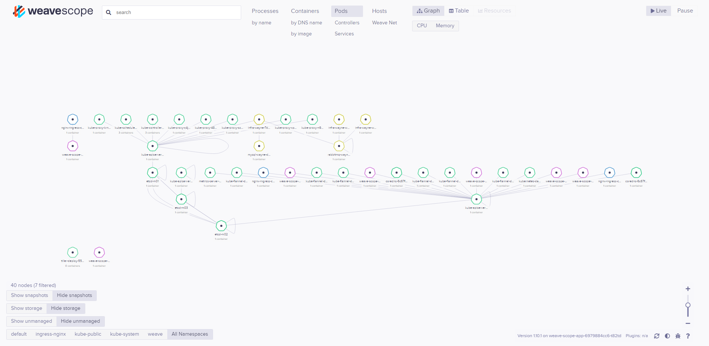
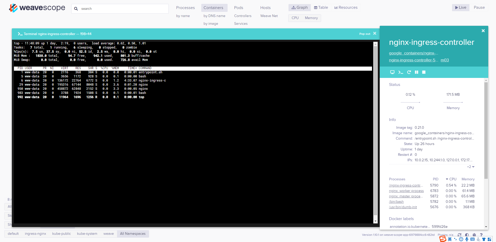
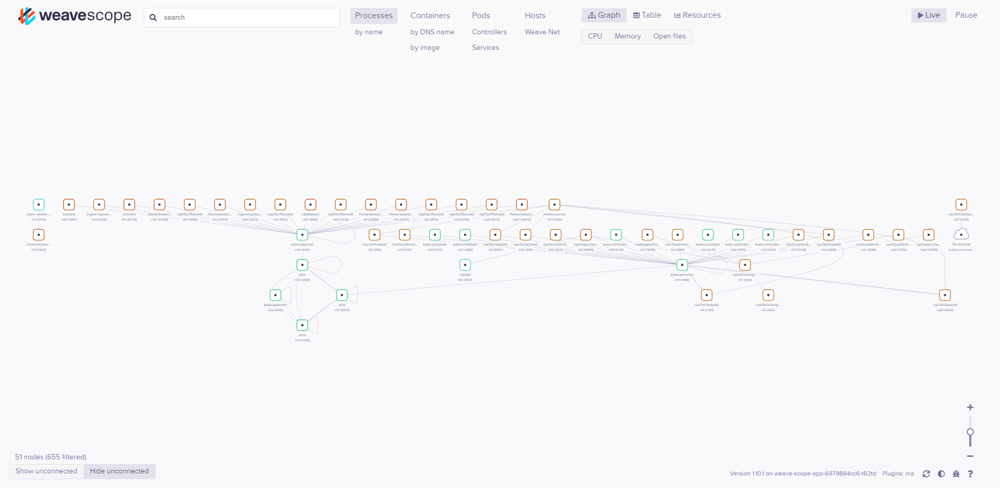

Weave Scope：实时监控 kubernetes 工具
---


Weave Scope 自动实时监控进程、容器、主机节点等，并提供 Web 终端在线和 Pod 、主机交互。


- [Installing Weave Scope](https://www.weave.works/docs/scope/latest/installing/#k8s)





## 1. 安装 Weave Scope

安装方式很简单，只需要下载对应 yaml 文件，通过 `kubectl apply -f ***.yaml` 进行安装即可。

官方介绍的安装方式：

```
kubectl apply -f "https://cloud.weave.works/k8s/scope.yaml?k8s-version=$(kubectl version | base64 | tr -d '\n')"
```

执行完成后，查看 Weave Scope 的 Pod 和 svc，如下：

```
[kube@m01 ~]$ kubectl  get pods -n weave 
NAME                               READY   STATUS    RESTARTS   AGE
weave-scope-agent-2qmcx            1/1     Running   0          38m
weave-scope-agent-5knlz            1/1     Running   0          38m
weave-scope-agent-6gbsw            1/1     Running   0          38m
weave-scope-agent-89fhv            1/1     Running   0          38m
weave-scope-agent-dnjwz            1/1     Running   0          38m
weave-scope-agent-szw7g            1/1     Running   0          38m
weave-scope-app-6979884cc6-t82td   1/1     Running   0          38m
[kube@m01 ~]$ kubectl  get svc -n weave 
NAME              TYPE        CLUSTER-IP    EXTERNAL-IP   PORT(S)   AGE
weave-scope-app   ClusterIP   10.102.52.0   <none>        80/TCP    38m

```

## 2. 配置 ingress 暴露服务

添加 ingress 暴露服务，详细配置文件 `ingress.yaml` 如下：

```
apiVersion: extensions/v1beta1
kind: Ingress
metadata:
  name: weave-scope-ingress
  namespace: weave 
spec:
  rules:
  - host: weave.k8s.hiko.im
    http:
      paths:
      - path: /
        backend:
          serviceName: weave-scope-app
          servicePort: 80

```

通过 `kubectl apply -f ingress.yaml` 暴露服务。

##3. 访问

将 weave.k8s.hiko.im 解析到 k8s 集群的 ingress 机器，再通过浏览器访问：http://weave.k8s.hiko.im , 将看到：


